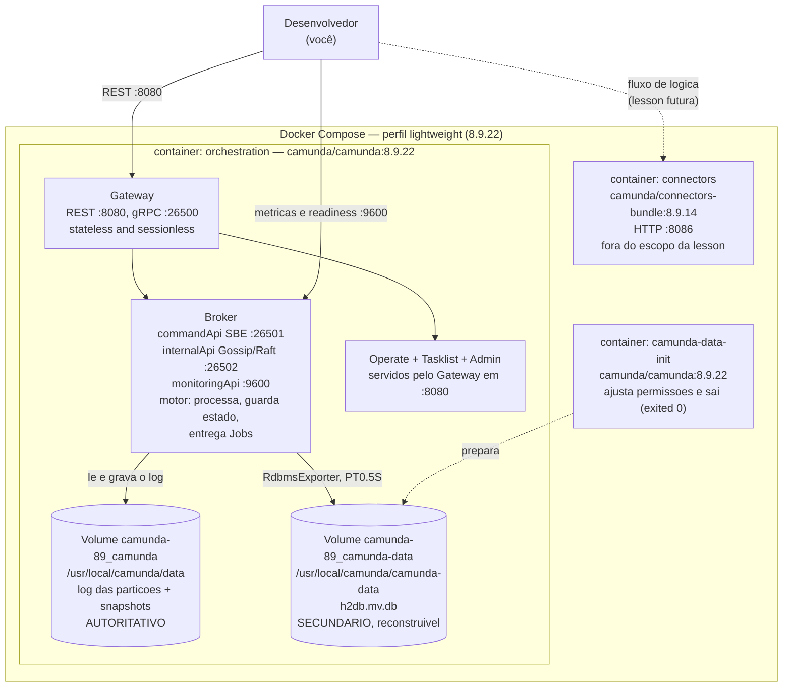

# C4 L2 — Container: Camunda 8 Orchestration Cluster (lightweight, local)

**Escopo:** os containers realmente observados em execução em 2026-09-29, via o Compose *lightweight*
oficial vendorizado.
**Evidência:** [evidence da Lesson 001](../../lessons/001-camunda7-8-mental-model/evidence.md).
**Mapa de componentes:** [camunda-8-local-components.md](../../camunda/camunda-8-local-components.md).

> **Nota sobre o formato.** Rotulado como **C4 — Container View**, desenhado em `flowchart`. A
> sintaxe `C4Container` do Mermaid falha neste grafo com `Parse error on line 22 … Expecting
> 'RBRACE', got 'EOF'`. Nível arquitetural L2 preservado; notação `flowchart`. Ver
> [decisões](../decisions.md).

## Diagrama de container

Escopo: o que roda, e o que cada peça guarda. Os componentes lógicos do cluster aparecem **dentro**
do container `orchestration`, porque é assim que a 8.9 os empacota.

## Dois armazenamentos lado a lado

O coração da transição C7 → 8 está nesta tabela, e a distinção é de **papel**, não de presença.

| | Estado de execução | Armazenamento secundário |
| --- | --- | --- |
| Onde | volume `camunda-89_camunda` | volume `camunda-89_camunda-data` |
| Caminho no container | `/usr/local/camunda/data/raft-partition` | `/usr/local/camunda/camunda-data` |
| Em disco | `raft-partition-partition-1-1.log`, `snapshots/`, `runtime/*.sst` | `h2db.mv.db`, `h2db.trace.db` |
| Mecanismo | Broker do Zeebe (log append-only + snapshots) | `RdbmsExporter` (mão única, `flushInterval: PT0.5S`) |
| Consulta por SQL? | Não | Sim |
| Impacto de perda | **Estado dos processos é perdido** | Projeções perdidas; reconstruível a partir do log |
| Autoritativo? | **Sim** | Não |

A observação que fecha a tabela: `/actuator/health` expõe `rdbmsStatus` com
`"database": "H2"` como componente de saúde. O H2 é monitorado pela plataforma, e ainda assim
não é onde o estado de execução vive. **Verificado e monitorado não é o mesmo que autoritativo.**

## Portas

Fonte: `docs.camunda.io/docs/self-managed/components/orchestration-cluster/zeebe/operations/network-ports`
(fetido 8.9).

| Porta | Componente | Protocolo | Publicada? |
| --- | --- | --- | --- |
| `8080` | Gateway | REST + as três UIs | Sim |
| `26500` | Gateway | gRPC — **é por aqui que o Worker fala** | Sim |
| `26501` | Broker | `commandApi`, Gateway→Broker, **SBE** | **Não** |
| `26502` | Broker e Gateway | `internalApi` Gossip/Raft; também `gateway.cluster.port` | **Não** |
| `9600` | Broker | `monitoringApi`: métricas e readiness | Sim |

`26501` **não é gRPC**: a doc diz *"Gateway-to-broker communication, using an internal SBE (Simple
Binary Encoding) protocol"*. E `9600` é a porta do **Broker**, não do Gateway — num cluster de nó
único isso é indistinguível a olho nu, mas o contrato é do Broker.

## Notas

- `orchestration` e `connectors` usam nomes de container fixos, e a rede tem nome fixo (`camunda`),
  herdados do Compose oficial. O laboratório não roda duas cópias lado a lado sem editar esses
  nomes. Documentado aqui para não ser surpresa depois.
- O Compose é vendorizado (ver `infra/local/fetch-compose.sh`) e aparado: sem exemplos BPMN, sem
  Playwright/e2e, sem stack de gerenciamento. `connectors` foi mantido porque faz parte da
  definição oficial *lightweight*, e está explicitamente fora do escopo da lesson.
- **Achado menor registrado, não corrigido:** existe uma rede `camunda-89_default`, do mesmo
  projeto, sem nenhum container ligado — resíduo de uma execução anterior. Não afeta o diagrama.
  Ver [evidence §1.5](../../lessons/001-camunda7-8-mental-model/evidence.md).

---

## Diagram Review

- [x] Sintaxe Mermaid validada por `docs/validate-mermaid.sh`
- [x] Diagrama renderiza
- [x] Nível arquitetural L2 — rotulado no texto; containers são nós, e componentes lógicos aparecem
      **dentro** do container que os hospeda, como o L2 permite
- [x] Componente lógico e container físico não estão misturados — cada nó indica se é container ou
      componente lógico
- [x] Todos os nós têm responsabilidade definida no texto
- [x] Relações válidas
- [x] Direção das relações correta
- [x] Sem nós órfãos — `camunda-data-init` e `connectors` têm relação explícita
- [x] Sem componentes não explicados
- [x] Sem componente fictício — todos os containers existem no `docker compose ps` real
- [x] Sem contradição com o texto do documento
- [x] Sem contradição com o C4 Context
- [x] Alegações sensíveis a versão verificadas — release notes do 8.9 e doc de network ports,
      `fetch 200`
- [x] Rótulos e documentação em PT-BR

**Correções registradas nesta revisão.**

- **`:9600` apontava para o Gateway.** Passou a apontar para o **Broker**: a porta é a
  `monitoringApi` do Broker (*"Metrics and Readiness Probe"*), não do Gateway. Num cluster de nó
  único a diferença é invisível a olho nu, porque os dois são o mesmo processo Java — o que é
  exatamente por que ela precisava ser corrigida contra a documentação, e não contra a observação.
- **`26501` estava rotulada "gRPC interno".** É a `commandApi`, Gateway→Broker, com protocolo
  **SBE** (*Simple Binary Encoding*). Ver
  [network ports](https://docs.camunda.io/docs/self-managed/components/orchestration-cluster/zeebe/operations/network-ports).
