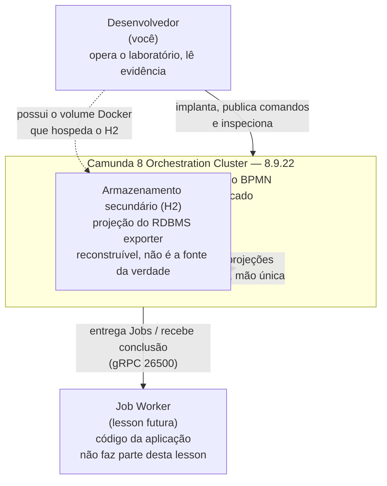

# C4 L1 — System Context: Camunda 8 Learning Lab

**Escopo:** o que é o ambiente local do laboratório e quem conversa com ele.
**Status:** criado a partir da execução observada de 2026-09-29.
**Evidência:** [evidence da Lesson 001](../../lessons/001-camunda7-8-mental-model/evidence.md).
**Mapa de componentes:** [camunda-8-local-components.md](../../camunda/camunda-8-local-components.md).

> **Nota sobre o formato.** Este diagrama é rotulado como **C4 — Context View** porque é uma visão
> de contexto, mas é desenhado em `flowchart`, não em `C4Context`. A sintaxe `C4Context` do Mermaid
> falha ao renderizar este grafo (`C4 rel "dev" -> "sec" references an unknown shape`), e um
> diagrama que não renderiza não é evidência de nada. O nível arquitetural continua sendo L1; apenas
> a notação é `flowchart`. Ver [decisões](../decisions.md).

## Diagrama de contexto

Visão de **sistemas**, não de componentes. Quem está dentro do Orchestration Cluster é detalhe da
visão de container.

> **Sobre o H2 dentro da fronteira.** O H2 é desenhado **dentro** do cluster, e isso é
> intencional: fisicamente ele é um arquivo no volume `camunda-89_camunda-data`, montado no
> container `orchestration` (`docker exec orchestration ls /usr/local/camunda/camunda-data`
> mostra `h2db.mv.db`). Ele não é um banco externo em outra máquina.
>
> Ele continua sendo uma **projeção reconstruível**, e o fato de estar dentro da fronteira física
> não muda o papel. Uma visão de contexto é uma visão de **sistemas**; quando o H2 é secundário e
> reconstruível, ele não é um sistema com o qual alguém negoceia — é um detalhe interno do cluster,
> e desenhá-lo como sistema externo de primeira classe sugeriria que ele é um componente
> independente com o qual se conversa. Ver [visão de container](001-container.md) para onde ele
> realmente vive.

## O que este diagrama deliberadamente não mostra

- **Nenhum componente interno do cluster.** Zeebe, Gateway, Broker, Operate, Tasklist e Admin são
  detalhe da [visão de container](001-container.md). Desenhá-los aqui duplicaria a informação e
  esconderia a única coisa que importa neste nível: o estado autoritativo está **dentro** do cluster.
- **Nenhum banco externo.** Observado: o processo não abre conexão para 5432 / 3306 / 1521 /
  27017 / 1433, e não existe serviço de banco na stack. O H2 é *dentro* do container, e é
  reconstruível.
- **Nenhum Kafka.** Correlação de mensagens por Kafka é uma lesson posterior; não está implícita
  aqui.
- **Plano de gerenciamento** (Console, Web Modeler, Identity, Keycloak, Optimize). Este é o
  Compose *lightweight*; o perfil *full* os adiciona.
- **Sua aplicação cliente.** Ela é a mesma peça que o Job Worker, e nenhuma das duas existe ainda —
  por decisão de escopo.

## Ponto central da visão de contexto

O fato estrutural mais importante neste nível é: **o estado autoritativo está dentro do
Orchestration Cluster, não em um banco que o laboratório possua.** Quem opera isso opera um
cluster, não um banco de dados.

Corolário: o H2 aparece no diagrama, dentro da fronteira, e ainda assim não é onde o estado de
execução vive. Ele é uma projeção reconstruível, e representá-lo como sistema externo com relação
de mão única seria sugerir que ele é um componente independente com o qual se conversa. Ele não é.

---

## Diagram Review

- [x] Sintaxe Mermaid validada por `docs/validate-mermaid.sh`
- [x] Diagrama renderiza
- [x] Nível arquitetural L1 — rotulado no texto; mostra pessoas e sistemas lógicos. Containers e
      componentes **não** aparecem como nós de primeiro nível
- [x] Componente lógico e container físico não estão misturados — nenhum container é nó deste
      diagrama
- [x] Todos os nós têm responsabilidade definida no texto
- [x] Relações válidas
- [x] Direção das relações correta
- [x] Sem nós órfãos
- [x] Sem componentes não explicados
- [x] Sem componente fictício — `Job Worker` e `Sua aplicação cliente` não existem ainda, e o texto
      diz isso explicitamente na seção "O que este diagrama **não** mostra"
- [x] Sem contradição com o texto do documento
- [x] Sem contradição com o C4 Container
- [x] Alegações sensíveis a versão verificadas — release notes do 8.9, `fetch 200`
- [x] Rótulos e documentação em PT-BR

**Ressalva de fidelidade, registrada e não resolvida.** Dois pontos deste diagrama não são
 C4 L1 estrito:

- `DEV -.-> H2` liga uma pessoa a um artefato interno de um sistema. Numa leitura estrita de C4 L1,
  esse artefato não deveria ser nó.
- `OC --> H2` liga o cluster a si mesmo.

Ambos foram mantidos porque escondê-los apagaria a única informação estrutural que o diagrama existe
para entregar: **o estado autoritativo está dentro da fronteira do cluster**. Um diagrama
"corretíssimo" e inútil seria uma troca de correção por esterilidade. O custo é declarado aqui.

**Correção registrada.** O H2 foi **movido para dentro** da fronteira do Orchestration Cluster
numa revisão anterior. Ele está fisicamente no volume do container `orchestration`; desenhá-lo como
sistema externo sugeriria que é um componente independente com o qual se conversa.
