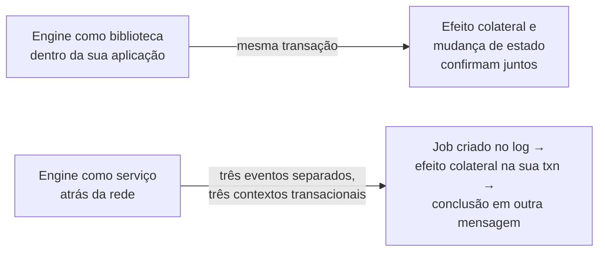

# Camunda 7 vs Camunda 8

Verificado contra: documentação do **Camunda 8.9** (ver
[ADR-0002](../adr/0002-camunda-8-version-pin.md)).
Evidência observada de toda afirmação marcada **Observado** está em
[evidence da Lesson 001](../lessons/001-camunda7-8-mental-model/evidence.md).

Esta nota separa três coisas de propósito, porque misturá-las é a principal fonte de resposta errada
em entrevista:

- **Fato** — afirmación da documentação oficial, com a versão a que pertence e a URL verificada.
- **Observado** — realmente visto em execução num Orchestration Cluster 8.9.22 em 2026-09-29.
- **Interpretação** — raciocínio do autor. Não é comportamento da Camunda.

---

## 1. A diferença em uma frase

> **A aplicação deixa de compartilhar uma fronteira transacional ACID com o engine de
> orquestração.**

Tudo o mais neste documento é consequência dessa única mudança.

E é aqui que a maioria dos materiais erra. A fórmula "o 7 usa banco, o 8 usa log" é verdadeira e
**insuficiente**: ela descreve a consequência visível e omite a causa. Quem aprende só a frase decora
a frase e continua incapaz de responder "onde entra a minha aplicação?".

A sequência real é:

No Camunda 7, criar o Job, executá-lo e persistir o resultado podiam acontecer dentro de uma única
transação. No Camunda 8, são três eventos distintos, em três contextos transacionais distintos, e
**não existe como envolvê-los em um commit só** — porque não existe um banco só, e porque não
acontecem no mesmo processo.

O "banco virou log" é o que essa mudança **produz**. Não é a mudança.

---

## 2. Arquitetura

### Camunda 7 (Fato)

Uma instância do Process Engine, implantada como biblioteca dentro da sua aplicação ou como engine
compartilhado, conecta via JDBC a **um** banco. O engine grava seu estado de runtime em tabelas
`ACT_RU_*`, suas definições em `ACT_RE_*`, e o histórico em `ACT_HI_*` — **no mesmo banco**.

API, REST, Tasklist, Cockpit e Optimize são todos consumidores desse mesmo banco. Não há mecanismo
separado de replicação do estado do engine.

### Camunda 8 (Fato + Observado)

O Orchestration Cluster tem **cinco** componentes lógicos:

| Componente lógico | Papel |
| --- | --- |
| **Broker** | Executa as instâncias. Guarda o estado de execução. Particiona e replica com Raft. |
| **Gateway** | Ponto de entrada REST/gRPC. Proxy dos comandos para a partição correta. *Stateless*. |
| **Operate** | Monitoramento e incidentes. Lê uma projeção, nunca escreve estado. |
| **Tasklist** | Tarefas humanas. Lê uma projeção, nunca escreve estado. |
| **Admin** | Autenticação e autorização integradas. |

**Fato (8.9).** A documentação oficial lista **cinco** entradas, mas outras: `Zeebe`, `Operate`,
`Tasklist`, `Admin` e `APIs`. A tabela acima substitui `Zeebe` por `Gateway` + `Broker` e remove
`APIs`. Mesmo total, listas diferentes. Ver
[mapa de componentes](camunda-8-local-components.md).

**Fora do cluster**, e portanto **fora** da contagem acima:

| Componente | Onde roda |
| --- | --- |
| **Connectors** | Container separado, `camunda/connectors-bundle:8.9.14` |
| **Job worker** | **Seu código**, em aplicação sua, em processo separado |

**Observado.** Uma advertência que quase todo material erra: esses cinco componentes lógicos
**não são cinco containers**. Desde o patch 8.9.12 a Camunda deixou de produzir as imagens
`camunda/zeebe`, `camunda/operate` e `camunda/tasklist`; usa a imagem unificada `camunda/camunda`.
Aqui, `docker exec orchestration ps` mostra **um único** processo Java, `PID 1`.

No ambiente deste laboratório:

- o broker é alcançado pelo gateway; `/v2/topology` mostra um cluster de nó único com uma partição
  `leader`, `healthy`, versão `8.9.22`;
- o processo **não** abriu conexão com banco externo algum — 5432, 3306, 1521, 27017, 1433;
- o estado de execução existe em disco como um log Raft mais snapshots, em
  `/usr/local/camunda/data/raft-partition/partitions/1/`.

Ver [mapa de componentes](camunda-8-local-components.md).

---

## 3. Armazenamento

### Camunda 7 (Fato)

Um banco, duas preocupações misturadas:

- **estado de runtime/autoritativo** — `ACT_RU_*`
- **histórico/dados operacionais** — `ACT_HI_*`

Se o banco estiver indisponível, o engine não roda **e** você não consegue reportar o que rodou. A
mesma indisponibilidade acerta as duas preocupações ao mesmo tempo.

### Camunda 8 (Fato + Observado)

Dois armazenamentos com trabalhos diferentes, e nesta topologia dois volumes Docker diferentes:

| | Camunda 7 | Camunda 8 (observado) |
| --- | --- | --- |
| Estado autoritativo | Tabelas `ACT_RU_*`, via JDBC | Log Raft + snapshots |
| O que quebra se o armazenamento cai | O engine não roda | O broker não elege líder / não roda |
| Dados operacionais/histórico | Tabelas `ACT_HI_*`, mesmo banco | Projeção do RDBMS exporter |
| Quem escreve | O próprio engine | Um **exporter**, mão única, assíncrono |
| Pode ser perdido? | Não — *é* o registro do sistema | Sim — pode ser **reconstruído** do log |

**Fato (8.9).** A doc do RDBMS Exporter, verbatim: *"The RDBMS Exporter consumes records from the log
stream, transforming relevant records and writing them to secondary storage database tables. Operate
and Tasklist query this secondary storage data through the Orchestration Cluster APIs."*

Três coisas nessa frase: o fluxo **vem do log**; o destino são **tabelas de secondary storage**; e
Operate e Tasklist **consultam** — não possuem nem governam.

**Observado.** Dois volumes separados, com conteúdos que não se misturam:

- volume `camunda-89_camunda` → `/usr/local/camunda/data/raft-partition` (estado de execução)
- volume `camunda-89_camunda-data` → `/usr/local/camunda/camunda-data/h2db.mv.db` (H2)

> **Correção que vale memorizar.** Um resumo muito comum e muito errado é "Camunda 8 não tem banco".
> No ambiente 8.9.22 observado há *sim* um banco relacional — um arquivo H2, e ele é monitorado como
> componente de saúde (`rdbmsStatus.database: "H2"`). O que está errado não é o banco, é o **papel**:
> H2 é *secondary storage*, escrito por um exporter, e perdê-lo perde projeções, não estado de
> processo. A afirmação precisa é: *"Camunda 8 não usa banco como fonte da verdade"*.
>
> Uma segunda correção, sobre nomes de arquivo: uma versão anterior deste documento afirmava que o
> primary storage continha `MANIFEST-*` e `zeebe.metadata`. O `ls` do diretório mostra que **nenhum
> dos dois existe**. A afirmação vinha de memória de documentação, não de observação.

---

## 4. Escala e disponibilidade

| | Camunda 7 | Camunda 8 |
| --- | --- | --- |
| Escalar para cima | Mais instâncias do engine, **mas** disputam um banco | Mais partições, replicadas por Raft |
| Escalar para fora | Replicação do banco é a história de escala | Adicionar brokers/partições; replicação já vem embutida |
| Alta disponibilidade | HA do banco + HA da aplicação | Replicação Raft entre brokers |
| Limite de concorrência | Efetivamente a capacidade do seu banco | Contagem de partições (1 por partição) |

**Interpretação.** No Camunda 7, adicionar instâncias do engine não compra vazão se elas compartilham
um banco — você compra sobretudo redundância, e adiciona contenção. No Camunda 8 a unidade de
paralelismo *é* a partição, e a replicação vem junto. A pergunta operacional muda de "o banco está
saudável" para "todas as partições e seus líderes estão saudáveis" — que é exatamente o que
`/v2/topology` reporta.

**Observado.** O cluster reporta duas estratégias de roteamento independentes:
`requestHandling: AllPartitions` e `messageCorrelation: HashMod`. Consequência prática: os eventos de
uma instância caem sempre na mesma partição, e **mudar a contagem de partições re-distribui todas as
*correlation keys***. Por isso a contagem de partições é uma decisão de arquitetura, e não um botão
de performance.

---

## 5. Integração e execução de trabalho

| | Camunda 7 | Camunda 8 |
| --- | --- | --- |
| Execução do trabalho | O engine chama **você**, dentro da mesma JVM | **Você** puxa trabalho, fora do processo |
| Acoplamento | Cliente in-process, mesma fronteira de confiança | Protocolo gRPC de job, fronteira de confiança separada |
| Unidade de falha | A transação do engine | O **job** |

**Fato (8.9).** A doc de arquitetura do Zeebe: *"The Zeebe Broker is the distributed workflow engine
that tracks the state of active process instances… no application business logic lives in the
broker."* E: *"A job worker is a Zeebe client."*

**Interpretação.** No Camunda 7, um job é uma linha processada dentro da sua transação. No Camunda 8,
um job é um registro no log, e "o trabalho falhou" se torna um *evento durável e retentável*, e não
um stack trace dentro do engine.

A consequência prática é a **idempotência obrigatória**: se o efeito colateral happen e a conclusão
falhar, o job volta. Não há fronteira transacional que proteja esse caso, porque a fronteira virou
rede. E não é um cenário de canto — at-least-once é o modo normal de operação.

> É por isso que as lessons posteriores do laboratório, sobre retries, idempotência e incidentes, só
> fazem sentido **depois** desta. No Camunda 8 não existe fronteira de `try/catch` que proteja, e o
> sistema é construído assumindo que a fronteira será cruzada mais de uma vez.

---

## 6. Multi-tenancy

| | Camunda 7 | Camunda 8 (Fato, 8.9) |
| --- | --- | --- |
| Mecanismo | Uma **instância de engine por tenant** | Um **identificador de tenant** nos dados |
| Custo por tenant | Engine nova, datasource novo, deployment novo | Uma fronteira lógica, cluster compartilhado |
| Isolamento | Isolamento físico de processo/banco | Lógico, verificado em runtime |

**Fato (8.9).** Multi-tenancy no Camunda 8 é *logical tenancy*, disponível em SaaS e Self-Managed. Um
tenant é criado pela API do Orchestration Cluster (`POST /v2/tenants`, adicionado na 8.8) e
identificado por um `tenantId`. A multi-tenancy está *habilitada* por padrão, mas as **verificações**
de multi-tenancy estão **desabilitadas** por padrão, e todos os dados mapeiam para o tenant
`<default>` até que as verificações sejam habilitadas.

**Interpretação.** Este é um trade-off real, não uma vitória pura. O tenancy por engine do C7 é
caro, mas o isolamento é rígido. O tenancy lógico do C8 é barato de provisionar, mas o isolamento
passa a depender de cada call site passar o `tenantId` certo — um identificador ausente ou errado é um
bug de **exposição de dados**, não um crash. Se você migrar tenancy de C7 para C8, precisa decidir, por
tenant, se "isolado logicamente" basta.

---

## 7. O que **não** mudou

- BPMN continua sendo a linguagem de modelagem, e a maior parte do vocabulário atravessa: *process
  definition*, *process instance*, *task*, *user task*, *service task*, incidente.
- Você continua **não** escrevendo SQL contra tabelas do engine, em nenhuma das duas versões.
- Operate continua sendo a ferramenta de monitoramento e incidentes. O papel dele é **mais** central
  no C8, não menos — precisamente porque o engine é distribuído.

---

## 8. Consequências para uma migração

**Interpretação**, derivada dos pontos acima:

1. **Seu problema de banco muda de forma.** Se você escolheu o Camunda 7 para reaproveitar um banco
   operacional existente, esse não é mais o modelo. Você está escolhendo uma topologia de brokers
   mais um alvo de exporter opcional.
2. **Revisões de disponibilidade mudam a pergunta.** "O banco está no ar" é substituído por "o líder
   de cada partição está saudável, e meu exporter está em dia".
3. **Revisões de escala mudam a unidade.** Partições, não instâncias de engine.
4. **Tratamento de falha vira design de primeira classe**, e não detalhe de tratamento de erro,
   porque a fronteira de trabalho agora é uma fronteira de rede.
5. **Backup e restore são duas operações.** Restaurar só o banco produz um cluster cujas projeções
   discordam do log. Verificar por que o que importa é o estado de execução, e não a projeção.
6. **As ferramentas de operação entram no produto.** Operate e Tasklist são as interfaces primárias,
   então habilitação e RBAC viram um workstream de migração.

---

## 9. Armadilhas de entrevista

| Afirmação | Veredito | Por quê |
| --- | --- | --- |
| "Camunda 8 não tem banco" | **Falso** | Secondary storage existe; não é a fonte da verdade. Ver §3 |
| "Camunda 8 é stateless" | **Falso** | O broker é explicitamente stateful; o **Gateway** é a parte stateless |
| "Camunda 8 substituiu o banco" | **Meia verdade** | Substituiu o banco como *registro do sistema*, e moveu SQL para papel derivado e reconstruível |
| "A única diferença é o deployment" | **Falso** | O modelo de persistência, a fronteira de execução e a unidade de escala mudaram |
| "O Camunda 8 chama seu código" | **Falso** | Seu código fala com o gateway e puxa jobs. E *"no application business logic lives in the broker"* |
| "O Camunda 8 tem N componentes = N containers" | **Falso** | No 8.9 são 5 componentes lógicos em **1** container. Ver §2 |
| "Zeebe é o engine que guarda o estado e recebe comandos" | **Impreciso** | São dois componentes: o **Broker** guarda o estado, o **Gateway** recebe. Ver §2 |
| "O Camunda 8 Run é o mesmo que Self-Managed" | **Falso** | Distribuições diferentes. Ver [Lesson 001 §2](../lessons/001-camunda7-8-mental-model/lesson.md) |

---

## Relacionados

- [Lesson 001 — Onde esses conceitos vivem dentro do Camunda 8](../lessons/001-camunda7-8-mental-model/lesson.md)
- [evidence da Lesson 001](../lessons/001-camunda7-8-mental-model/evidence.md)
- [Mapa de componentes do laboratório](camunda-8-local-components.md)
- [ADR-0002 — pin de versão](../adr/0002-camunda-8-version-pin.md)
- [C4 Context](../architecture/c4/001-context.md) · [C4 Container](../architecture/c4/001-container.md)

---

## Diagram Review

- [x] Sintaxe Mermaid validada por `docs/validate-mermaid.sh`
- [x] Diagrama renderiza
- [x] Nível arquitetural — diagrama de **contraste C7 → C8**, não C4. Rotulado como tal no texto
- [x] Componente lógico e container físico não estão misturados
- [x] Todos os nós têm responsabilidade definida no texto
- [x] Relações válidas e com direção correta
- [x] Sem nós órfãos
- [x] Sem componente fictício
- [x] Sem contradição com o texto da nota
- [x] Sem contradição com o mapa de componentes nem com a Lesson 001
- [x] Alegações sensíveis a versão verificadas — ver tabela de fontes na
      [evidence da Lesson 001](../lessons/001-camunda7-8-mental-model/evidence.md)
- [x] Rótulos e documentação em PT-BR
