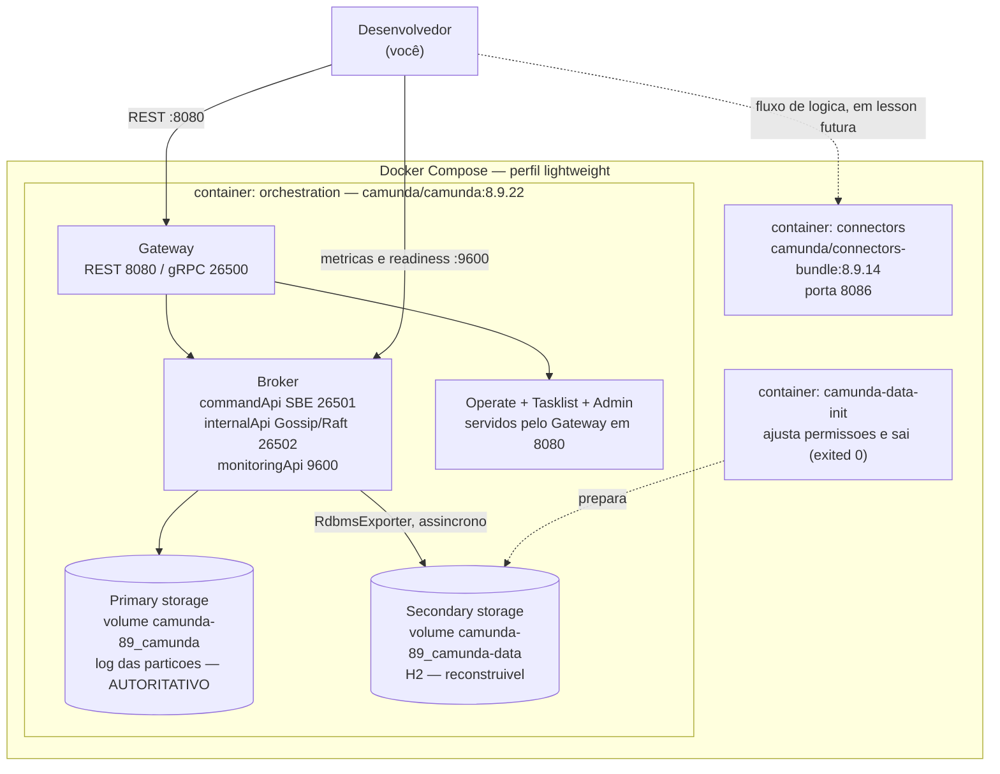

# Mapa de componentes — Camunda 8 local (laboratório)

Escopo: **Camunda 8 Self-Managed**, perfil *lightweight* via Docker Compose, **8.9.x**,
verificado em `8.9.22` em 2026-09-29.

Este documento existe para responder a uma pergunta que quase todo material de Camunda 8
responde mal: **"quantos componentes o Camunda 8 tem?"** A resposta honesta depende de qual
granularidade você está contando, e confundir as duas é a fonte de metade dos erros sobre
arquitetura de Camunda 8.

Fonte primária: [evidence da Lesson 001](../lessons/001-camunda7-8-mental-model/evidence.md).
Diagramas: [C4 — Context View](../architecture/c4/001-context.md) ·
[C4 — Container View](../architecture/c4/001-container.md).

---

## A regra que organiza tudo

> **Componente lógico ≠ container ≠ processo.**

São três granularidades distintas, e cada uma tem uma resposta diferente para "quantos".

| Pergunta | Resposta neste laboratório | Onde se verifica |
| --- | --- | --- |
| Quantos **componentes lógicos** no Orchestration Cluster? | **5** — Gateway, Broker, Operate, Tasklist, Admin | `docker exec orchestration ps` mostra **1** processo |
| Quantos **processos Java** no cluster? | **1** | PID 1 |
| Quantos **containers** em execução? | **2** — `orchestration`, `connectors` | `docker compose ps` |
| Quantos **serviços** declarados? | **3** — o terceiro é um `init` que sai com código 0 | `docker compose config --services` |

Um número não contradiz o outro. Respondem a perguntas diferentes.

---

## Os 5 componentes lógicos do Orchestration Cluster

**Fato (8.9).** A documentação do Orchestration Cluster lista **cinco** entradas: *"The Orchestration
Cluster includes: Zeebe as the workflow engine, Operate for monitoring and troubleshooting process
instances running in Zeebe, Tasklist for interacting with user tasks, Admin (formerly Orchestration
Cluster Identity) for managing the integrated authentication and authorization, and APIs for
interacting with the Orchestration Cluster programmatically."*
Fonte: `docs.camunda.io/docs/self-managed/components/orchestration-cluster/overview`, fetch 200.

**Interpretação — como se chega a cinco.** Uma versão anterior deste documento dizia "sete
componentes", e a conta não fechava. A derivação honesta:

| Passo | O que acontece | Total |
| --- | --- | --- |
| Documentação oficial | Zeebe, Operate, Tasklist, Admin, APIs | **5** |
| "APIs" sai da contagem | É uma **capacidade** do Gateway, não um componente com processo próprio | 4 |
| "Zeebe" é **substituído** por duas entradas | Gateway e Broker, com responsabilidades distintas | **5** |

A conta é **5 − 1 (APIs sai) − 1 (Zeebe sai) + 2 (Gateway e Broker entram) = 5**. O erro anterior
mantinha "Zeebe" na tabela **e** somava Gateway e Broker ao lado dele: contava o motor duas vezes e
ainda contava APIs, chegando a um sete que não correspondia a nada.

**Atenção à coincidência.** A lista deste laboratório e a lista oficial têm o mesmo tamanho, cinco,
mas **não são a mesma lista**: a oficial tem `Zeebe` e `APIs`; esta tem `Gateway` e `Broker`. É
exatamente por isso que responder "cinco" sem dizer *quais* cinco não serve.

A subdivisão Gateway/Broker é **deste laboratório**, não da Camunda. Ela existe porque é a única que
permite responder "quem guarda o estado" e "quem recebe o comando" separadamente. Ao citar a
documentação, cite as cinco entradas oficiais.

| # | Componente | Papel | Estado autoritativo? | Necessário p/ executar? | No cluster? |
| --- | --- | --- | --- | --- | --- |
| 1 | **Gateway** | Ponto de contato; roteia; publica a API; serve as UIs | Não | Sim | Sim |
| 2 | **Broker** | Engine distribuído; processa; guarda estado; entrega Jobs | **Sim** | **Sim** | Sim |
| 3 | **Operate** | Monitoramento e troubleshooting de instâncias | Não | Não | Sim |
| 4 | **Tasklist** | Interação com *user tasks* (atribuir, completar) | Não | Não | Sim |
| 5 | **Admin** | Autenticação e autorização integradas | Não | Não | Sim |

> "APIs" entrou na lista oficial, mas **não** está nesta tabela: é a superfície REST/gRPC do Gateway,
> não um componente com processo próprio.

### Zeebe não é um componente, é um nome para um conjunto

**Fato (8.9).** A doc de arquitetura define quatro componentes dentro de Zeebe: *"Clients,
Gateways, Brokers, Exporters"*. Quando alguém diz "Zeebe", pode estar falando do motor inteiro,
do Broker, ou do Gateway. Por isso este mapa sempre nomeia o componente específico.

**A distinção que resolve 90% das confusões:**

- **Gateway** — *"a single entry point"*, **stateless and sessionless**, só encaminha.
- **Broker** — *"the distributed workflow engine"*, guardador do estado, e onde
  *"no application business logic lives in the broker"*.

Se você diz "Zeebe guarda o estado", está falando do Broker. Se diz "Zeebe recebe comandos",
está falando do Gateway.

---

## Os componentes que NÃO existem neste laboratório

Isto importa tanto quanto o que existe: material que desenha estes no ambiente local está
desenhando o `docker-compose-full.yaml`, não o perfil *lightweight*.

| Componente | Existe no Camunda 8? | Neste laboratório? | Por quê |
| --- | --- | --- | --- |
| **Console** | Sim (gerenciamento, fora do cluster) | **Não** | Não faz parte do Orchestration Cluster; ausente no perfil *lightweight* |
| **Web Modeler** | Sim | **Não** | Só no perfil *full* |
| **Optimize** | Sim (analytics) | **Não** | Só no perfil *full* |
| **Management Identity** | Sim | **Não** | Idem. O **Admin** do cluster é outro componente |
| **Keycloak** | Sim (externo, no perfil *full*) | **Não** | Perfil *lightweight* usa autenticação simplificada |
| **Elasticsearch** | Sim (secondary storage) | **Não** | Perfil *lightweight* usa H2 |
| **OpenSearch** | Sim (idem) | **Não** | Idem |
| **Console / "Camunda Web"** | **Não é nome válido na 8.9** | **Não** | `/camunda` e `/c8` retornam **404** neste cluster |

O único componente **fora** do Orchestration Cluster que está de fato em execução é
**Connectors**, em container próprio.

---

## Containers reais

**Observado.** `docker compose config --services` → `camunda-data-init`, `orchestration`,
`connectors`.

| Container | Imagem | Papel | Estado | Portas publicadas |
| --- | --- | --- | --- | --- |
| `orchestration` | `camunda/camunda:8.9.22` | Os 5 componentes lógicos, em 1 processo | `Up (healthy)` | `8080`, `26500`, `9600` |
| `connectors` | `camunda/connectors-bundle:8.9.14` | Runtime de Connectors | `Up (healthy)` | `8086` |
| `camunda-89-camunda-data-init-1` | `camunda/camunda:8.9.22` | Ajusta permissões de volume e **sai** | `Exited (0)` | — |

### Por que 5 componentes viram 1 container

**Fato (8.9).** Das notas de release da 8.9: *"Camunda no longer produces the following Docker
images in Camunda 8.9, starting from patch release 8.9.12: `camunda/zeebe`, `camunda/operate`,
`camunda/tasklist`. Use the unified `camunda/camunda` Docker image instead."*

E, na mesma versão: *"The Operate, Tasklist, and Identity application profiles are now merged into
the existing gateway profile… These components are now treated as UIs served by the Zeebe
Gateway."*

**Consequência verificável.** `docker exec orchestration ps` mostra **um único** processo Java,
`PID 1`. E um único `lib/` com um único `config/`. Não há `lib/operate` nem `lib/tasklist`.

**Nota de versionamento.** Antes da 8.9.12 existiam imagens separadas. Material anterior a isso,
ou de 8.8, descreve uma topologia que **não** é a deste ambiente.

---

## Portas

**Fato (8.9).** Fonte:
`docs.camunda.io/docs/self-managed/components/orchestration-cluster/zeebe/operations/network-ports`.

| Porta | Componente lógico | Protocolo | Publicada? |
| --- | --- | --- | --- |
| `8080` | Gateway | HTTP + as UIs | Sim |
| `26500` | Gateway | gRPC — **é por aqui que o Worker fala** | **Sim** |
| `26501` | Broker | `commandApi` Gateway→Broker, **SBE** | **Não** — só na rede Docker |
| `26502` | Broker e Gateway | `internalApi` Gossip/Raft; também `gateway.cluster.port` | **Não** |
| `9600` | Broker | `monitoringApi`: métricas e readiness | Sim |
| `8086` | Connectors | HTTP | Sim |

Duas correções registradas nesta tabela:

- `26501` **não é gRPC**. A doc: *"Gateway-to-broker communication, using an internal SBE (Simple
  Binary Encoding) protocol."*
- `9600` é do **Broker**, não do Gateway: *"Metrics and Readiness Probe"*. Num cluster de nó único
  isso é indistinguível a olho nu, porque os dois são o mesmo processo Java.

**Interpretação.** A fronteira de rede entre a aplicação e o engine está literalmente na diferença
de notação: `0.0.0.0:26500` está publicado; `26501-26502` aparece sem prefixo de host. O desenho é
intencional — o cliente fala com o Gateway, e o Broker fica para trás. E é exatamente por isso
que `26501` **não** é a porta que o seu Worker usa.

---

## Armazenamento: dois volumes, dois papéis

**Observado.** Dois volumes nomeados, em caminhos distintos dentro do mesmo container.

| Volume | Caminho no container | Papel | Autoritativo? |
| --- | --- | --- | --- |
| `camunda-89_camunda` | `/usr/local/camunda/data` | **Primary storage** — log das partições, snapshots, estado materializado | **Sim** |
| `camunda-89_camunda-data` | `/usr/local/camunda/camunda-data` | **Secondary storage** — `h2db.mv.db` | Não |

**Fato (8.9).** Primary storage é *"the authoritative store for runtime execution state"*; e Zeebe
*"writes data directly to the file system on the same servers where it is deployed"*. Secondary
storage é *"populated from primary storage and optimized for querying rather than execution"*.

**Observado.** O Secondary tem `rdbmsStatus` como componente de **health** de primeira classe, com
`"database": "H2"`. Ele é monitorado. Isso não o torna autoritativo — significa apenas que
participar da plataforma implica ser verificável.

| | Primary storage | Secondary storage |
| --- | --- | --- |
| Caminho | `/usr/local/camunda/data/raft-partition` | `/usr/local/camunda/camunda-data` |
| Conteúdo | `raft-partition-partition-1-1.log`, `snapshots/`, `runtime/*.sst` | `h2db.mv.db`, `h2db.trace.db` |
| Alimentado por | O Broker, diretamente | O `RdbmsExporter` |
| Posição própria | `processedPosition` | `exportedPosition` |
| Se apagar | **Perde o estado dos processos** | Perde projeções; reconstruível |

---

## Diagrama

Ambiente físico do laboratório, com os componentes lógicos *dentro* do container `orchestration`:

A seta para `:9600` vai ao **Broker**, não ao Gateway, porque `9600` é a `monitoringApi` do Broker.
Num cluster de nó único as duas arestas são indistinguíveis na prática; o diagrama as separa porque
o contrato é do Broker.

O diagrama **conceitual** — o caminho de um comando até o efeito colateral, sem containers — está
na [Lesson 001, seção 9](../lessons/001-camunda7-8-mental-model/lesson.md#9-aplicação-cliente).
Os dois diagramas respondem a perguntas diferentes e não devem ser misturados.

---

## Referências versionadas

| Fato | Origem |
| --- | --- |
| Os 5 componentes do Orchestration Cluster, e *"Admin (formerly Orchestration Cluster Identity)"* | `docs.camunda.io/docs/self-managed/components/orchestration-cluster/overview` |
| Gateway *"stateless and sessionless"*; Broker *"the distributed workflow engine"*; *"no application business logic lives in the broker"* | `docs.camunda.io/docs/components/zeebe/technical-concepts/architecture` |
| Primary vs secondary storage; *"Embedded H2: A bundled secondary storage option for local development and lightweight setups"* | `docs.camunda.io/docs/components/concepts/concepts-overview` |
| RDBMS Exporter *"consumes records from the log stream"* → tabelas; Operate e Tasklist **consultam** | `docs.camunda.io/docs/self-managed/components/orchestration-cluster/zeebe/exporters/rdbms-exporter` |
| Imagem unificada a partir de 8.9.12; perfis de UI no gateway | `docs.camunda.io/docs/reference/announcements-release-notes/890/890-release-notes` |
| Perfil *lightweight* vs *full* | `docker-compose.yaml` e `docker-compose-full.yaml` upstream, vendorizados em `infra/local/camunda-8.9/` |

Evidência de execução, comando por comando:
[evidence.md](../lessons/001-camunda7-8-mental-model/evidence.md).

---

## Diagram Review

- [x] Sintaxe Mermaid validada por `docs/validate-mermaid.sh`
- [x] Diagrama renderiza
- [x] Nível arquitetural L2 — containers são nós; componentes lógicos aparecem **dentro** do
      container que os hospeda. Um diagrama conceitual, sem containers, está na
      [Lesson 001 seção 9](../lessons/001-camunda7-8-mental-model/lesson.md)
- [x] Componente lógico e container físico não estão misturados — cada nó declara qual é
- [x] Todos os nós têm responsabilidade definida no texto
- [x] Relações válidas e com direção correta
- [x] Sem nós órfãos
- [x] Sem componentes não explicados
- [x] Sem componente fictício — todos os containers existem no `docker compose ps` real
- [x] Sem contradição com o texto do documento
- [x] Sem contradição com os C4, que mostram o mesmo ambiente
- [x] Alegações sensíveis a versão verificadas — Orchestration Cluster overview, network ports e
      release notes do 8.9, `fetch 200`
- [x] Rótulos e documentação em PT-BR

**Correções registradas nesta revisão.**

- **`:9600` apontava para o Gateway.** Passou a apontar para o **Broker**: é a `monitoringApi`
  (*"Metrics and Readiness Probe"*). Num cluster de nó único a diferença é invisível a olho nu.
- **`26501` estava rotulada "gRPC interno".** É a `commandApi`, Gateway→Broker, protocolo **SBE**.
- **A contagem de componentes não fechava.** Ver a seção "Os 5 componentes lógicos".
