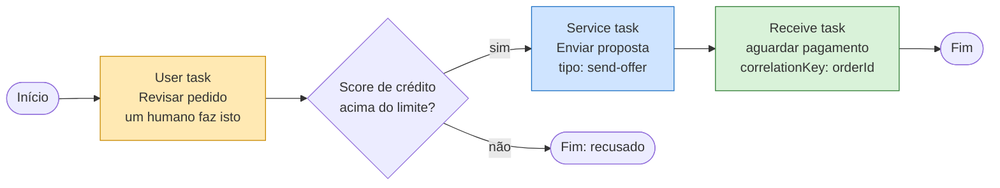

# LESSON-000 — Processo BPMN, instância, task, Job e Worker

Status: ready

Escopo de versão: **Camunda 8.9** ([ADR-0002](../../adr/0002-camunda-8-version-pin.md)).
Evidência: [evidence.md](evidence.md).
Continua em: [Lesson 001 — Onde esses conceitos vivem dentro do Camunda 8](../001-camunda7-8-mental-model/lesson.md).

## Como ler esta lesson

Toda afirmação está rotulada:

- **Fato (8.9)** — declarado pela documentação oficial do Camunda 8.9. Toda afirmação rotulada assim
  tem uma linha na [tabela de fontes](#fontes-deste-documento), com a URL e o método de
  verificação.
- **Observado** — realmente visto em um cluster 8.9.22 no dia 2026-09-29; comando e saída em
  `evidence.md`.
- **Interpretação** — meu raciocínio. Não é comportamento do Camunda.

## Objetivo

Antes de comparar dois produtos, é preciso saber o que é a **notação**, o que é o **motor** e
o que cada **palavra** significa. Esta lesson constrói essa base. Ela não escreve código e não
implanta nada.

Ao final, você deve ser capaz de responder, para qualquer palavra desta lista: *o que é, o que
faz, e o que quebra sem ela?*

## Contexto

Uma lesson anterior começava por "qual é a diferença entre Camunda 7 e Camunda 8". Essa pergunta
é inrespondível para quem ainda não sabe o que é uma *process instance*, o que é uma *service
task*, ou por que existe uma figura chamada *Worker*. Esta lesson preenche essa lacuna, na ordem
em que cada passo decorre do anterior.

## Conceito

Leia as cinco seções em ordem. Cada uma usa apenas palavras que a anterior definiu.

### 1. O problema que cria a necessidade

Um processo de negócio real — aprovar um empréstimo, cadastrar um cliente, enviar um pedido —
não é uma chamada de função. Ele atravessa:

- **sistemas diferentes** (um core bancário, um serviço de fraude, um provedor de e-mail),
- **equipes diferentes** e às vezes **empresas diferentes**,
- **tempo** — ele fica esperando a aprovação de uma pessoa durante a noite,
- **falha** — qualquer passo pode falhar, e falhar não pode perder o que veio antes.

Agora tente escrever isso como código comum, e algo quebra imediatamente. Uma chamada de função
retorna ou lança exceção. Ela não fica parada dois dias. Não é retomada em outra máquina. Não
diz, seis meses depois, o que aconteceu. Se o processo estiver em uma escrita de banco de dados,
o código já retornou — o código sumiu, e "onde está este pedido de empréstimo agora?" não é
responsabilidade de ninguém.

> **Essa lacuna é o motivo inteiro pelo qual motores de workflow existem.**

**Fato (8.9).** A própria documentação do Camunda descreve o produto como sendo para
"orquestrar e automatizar processos de negócio complexos que incluem pessoas, agentes de IA,
sistemas e dispositivos" — note que *pessoas* e *dispositivos* estão na lista, ao lado de
sistemas.

**Interpretação.** O que um motor de workflow **não** é: não é um `while` thread-safe, não é
uma máquina de estados em memória, não é um agendador de jobs. A propriedade que define a
categoria está na seção 2.

**O que quebraria sem o motor:** a espera.

### 2. A categoria: motor de workflow

Um **motor de workflow** (*workflow engine*) é software que:

1. **guarda o estado** de um processo de negócio de longa duração,
2. **o avança um passo de cada vez**, segundo uma sequência definida,
3. **entrega trabalho a terceiros** — uma pessoa, outro sistema, um serviço.

A propriedade definidora, e aquela que você deve reter:

> **O estado do processo sobrevive ao código que o iniciou.**

É por isso que o motor precisa persistir em algum lugar autoritativo. E é por isso que o local
onde ele persiste é uma decisão de arquitetura — e não um detalhe. Essa é a pergunta que a
[Lesson 001](../001-camunda7-8-mental-model/lesson.md) responde.

**O que quebraria sem a persistência:** o passo 3 da definição. Se o estado só existisse em
memória, no instante em que o processo entregasse trabalho a alguém, não sobraria nada para
retomar.

### 3. BPMN: uma notação, e padrão

**Fato (8.9).** BPMN **não** é uma invenção da Camunda. BPMN 2.0 é uma especificação do **OMG**
(Object Management Group), o mesmo órgão que publica UML. A Camunda consome BPMN; não é dona
dele.

Por que existe um padrão? Razão de negócio, não técnica: um diagrama de processo desenhado em
notação neutra de fornecedor pode ser lido pelo negócio, revisado por compliance, entregue a um
fornecedor diferente e sobreviver ao engenheiro que o desenhou sair da empresa. A notação é o
contrato.

O núcleo da notação é pequeno. O *primer* de BPMN da documentação 8.9 introduz **cinco** categorias,
nesta ordem:

| Elemento | O que significa | Lê-se como |
| --- | --- | --- |
| **Sequence flow** (a seta) | Ordem de execução | "então" |
| **Tasks** (tarefas) | Unidades atômicas de trabalho | "alguém faz isto" |
| **Gateways** | Roteamento mais complexo | "se / e / junção" |
| **Events** (eventos) | Coisas que acontecem | "quando isso ocorrer" |
| **Subprocesses** | Contêineres de elementos | "isto é um passo só, com detalhe por dentro" |

E a mesma página acrescenta uma **nota** sobre *swim lanes* (pools e lanes): *"Swim lanes (pools and
lanes) are only available at the top-level process or collaboration level. They cannot be added
inside a subprocess. This is a constraint of the BPMN 2.0 specification."*

Fonte: `docs.camunda.io/docs/components/modeler/bpmn/bpmn-primer`, fetch 200.

> **Correção registrada.** Uma versão anterior desta tabela dizia que a documentação "introduz
> **exatamente** estas categorias" e listava Events, Tasks, Gateways, Sequence flows e Pools/lanes.
> Duas coisas estavam erradas: **Subprocesses** faltava, e *swim lanes* não é uma das categorias
> introduzidas — é uma nota de restrição. Nenhuma das duas afirmações foi verificada na fonte quando
> foi escrita, e ambas estão corrigidas acima.

**Interpretação — por que subprocesses entram na lista.** Um subprocesso é o único elemento desta
tabela que introduz um problema **de arquitetura**, não só de notação: ele levanta a pergunta "o que
é uma unidade de trabalho?" que a Lesson 001 vai tratar como fronteira transacional. Um service task
dentro de um subprocesso ainda é um Job; um subprocesso inteiro pode ser um Job.

**Observado.** Nada disso está no cluster em execução, e não deveria estar. BPMN é uma
*descrição*. O diagrama não está executando.

**Interpretação.** Esse é o passo mental crucial e vale insistir: **o diagrama não roda.** Um
arquivo `.bpmn` é uma receita; uma instância em execução é o jantar.

### 4. As palavras que todo mundo confunde

Esta é a seção de maior valor da lesson. Quase toda confusão em Camunda 8 é uma destas oito
palavras sendo usada para a coisa errada.

**Fato (8.9)**, a partir da documentação oficial de *service task* e *receive task*:

| Palavra | O que é de fato | Analogia | O que quebraria sem ela |
| --- | --- | --- | --- |
| **Process definition** | O modelo BPMN implantado. Um modelo, versionado. | Uma classe, uma receita | Nada a instanciar |
| **Process instance** | Uma execução real daquela definição, com estado e dados próprios | Um objeto, uma transação | Não dá para distinguir duas execuções de clientes diferentes |
| **Variable** | Um pedaço nomeado de dado sobre a instância | Um campo | Não há dado sobre o qual agir |
| **Task** | Um passo do diagrama que exige trabalho | Um item de to-do | Não há unidade de trabalho |
| **User task** | Uma tarefa que um **humano** completa, via Tasklist | Um ticket | Humanos não conseguem participar |
| **Service task** | Uma tarefa que a **automação** executa, via um Job | Uma chamada de API durável | Não há passo automatizado |
| **Job** | A **unidade executável** criada ao entrar em uma service task | Uma mensagem numa fila | Não há nada para o seu código pegar |
| **Job Worker** | **O seu código**, inscrito em um tipo de Job, fazendo o trabalho | Um consumidor de fila | Ninguém executa o passo |

A cadeia, explicitada, porque estas três linhas respondem "por que eu preciso de um Worker":

```text
Service Task
    ↓  (ao entrar, o motor cria um Job)
Job
    ↓  (o Worker inscrito no tipo recebe o Job)
Worker
    ↓  (executa a lógica e confirma o Job)
Completion
    ↓  (só então a instância do processo avança)
```

**Fato (8.9).** O `zeebe:taskDefinition` da service task nomeia o `type` no qual os Workers se
inscrevem (por exemplo `send-offer`), e opcionalmente `retries` (padrão três). A *receive task*
funciona igual, mas com uma **inscrição de mensagem** no lugar de um Job:
`zeebe:subscription correlationKey="=orderId"`.

**Interpretação.** Observe o que a instância do processo está fazendo enquanto espera: nada. Ela
está *estacionada*, segurando apenas seu estado. Esse é o projeto inteiro em uma frase — o motor
é uma máquina de estados que pode ser interrompida por tempo indeterminado, e um Worker é apenas
um programa que é acordado quando há algo a fazer.

### 5. A forma de um processo, desenhada

Aqui está a notação em uso, com a vocabulário acima:



Leia com o vocabulário acima: uma **user task** é um passo humano; uma **service task** vira um
**Job** do tipo `send-offer` que um **job worker** precisa buscar; uma **receive task**
estaciona a instância até chegar uma **mensagem** correlacionada por `orderId`. A instância
avança apenas conforme cada um desses passos se completa.

**Nenhum arquivo BPMN foi implantado.** Este é um diagrama dentro de um documento, não um
processo rodando no cluster.

## Onde esta lesson termina — e o que falta para responder

Tudo o que foi definido aqui é **vocabulário**. Nada ainda disse *onde* essas coisas vivem.

Um **process definition** é implantado em algum lugar. Uma **process instance** é executada por
algum motor. Um **Job** é criado e fica esperando. Um **Worker** precisa saber onde se inscrever.

Não respondemos nenhuma dessas quatro perguntas aqui — de propósito. Respondê-las exige saber o
que é Zeebe, o que é Gateway, o que é Broker, o que é *secondary storage* e por que existe uma
tabela com H2 num ambiente que, na maioria das frases que você vai ler, "não tem banco de dados".

> **Onde esses conceitos vivem dentro do Camunda 8?**

Essa é a pergunta de entrada da
[Lesson 001 — Onde esses conceitos vivem dentro do Camunda 8](../001-camunda7-8-mental-model/lesson.md).
E é a pergunta que um desenvolvedor Java/Spring precisa ser capaz de responder desenhando, em um
papel, antes de escrever a primeira linha de worker.

## Evidência de que definition e instance são independentes

**Observado.** O cluster estava com uma partição `LEADER` saudável e o log na posição 6400+, e a
contagem de instâncias de processo era **zero**:

```
$ curl -s -X POST -H 'Content-Type: application/json' -u demo:demo \
    -d '{"filter":{}}' http://localhost:8080/v2/process-instances/search
{"page":{"totalItems":0,"hasMoreTotalItems":false,"startCursor":null,
  "endCursor":null},"items":[]}
```

Um motor em funcionamento e um processo de negócio ausente são fatos independentes. Os registros
naquele log eram contabilidade interna do cluster, não trabalho de cliente. Saída completa em
[evidence.md](evidence.md).

## O que esta lesson deliberadamente NÃO ensina

Para que a Lesson 001 tenha o que explicar, esta lesson **não** toca em:

- Zeebe, Gateway, Broker, Operate, Tasklist e demais componentes de runtime;
- onde o estado é armazenado, nem em que forma;
- o log distribuído, partições, Raft, RocksDB;
- `processedPosition` / `exportedPosition`;
- H2, *secondary storage* e o `RdbmsExporter`;
- a diferença Camunda 7 → 8.

Tudo isso pertence à Lesson 001. Mencionar aqui seria antecipar a conclusão e confundir o leitor
com conceitos sem base.

## Implementação

Nenhuma. Esta lesson é documentação. Entregáveis:

- `docs/lessons/000-camunda-bpmn-concepts/lesson.md` — este documento.
- `docs/lessons/000-camunda-bpmn-concepts/evidence.md` — as observações somente-leitura.
- `docs/modules/00-orientation/README.md` — registro do módulo.
- `specs/000-camunda-bpmn-concepts/` — a especificação por trás dela.

O cluster em execução foi reutilizado como estava, iniciado por
[`infra/local/README.md`](../../../infra/local/README.md).

## Execução

Somente-leitura. Nenhuma implantação, nenhuma mudança de estado.

```bash
cd infra/local/camunda-8.9
docker compose ps
curl -s http://localhost:8080/v2/topology
curl -s -X POST -H 'Content-Type: application/json' -u demo:demo \
  -d '{"filter":{}}' http://localhost:8080/v2/process-instances/search
```

Resultados principais: broker e gateway ambos `8.9.22`; **zero** instâncias de processo, com o
cluster saudável. Saída completa em [evidence.md](evidence.md).

## Falha / investigação / correção

Um beco real, registrado em `evidence.md` em vez de escondido.

**Beco 1 — a API antiga.** Procurei instâncias de processo em `/v1/processes` e recebi `404`. A API
v1 não existe mais; o 8.9 usa `/v2/…`, e o endpoint de instâncias é uma **busca `POST`**, não uma
listagem `GET`. Um `404` aqui seria facilmente reportado como "o engine não tem processos".

**Correção aplicada ao meu raciocínio.** Toda afirmação desta lesson aponta para um comando que
devolve *substância* — um papel de partição, uma contagem, um caminho de arquivo — e não para um
`200`. Um `200` prova apenas que algo respondeu.

**Beco 2 — um `200` que não queria dizer nada.** `GET /operate/v2/processes` devolveu `200`, e uma
verificação baseada apenas em status code teria registrado "endpoint de processos funcionando".
O corpo era `<!doctype html>` — o aplicativo de página única do Operate respondendo a uma rota,
não uma API.

## Implicações de arquitetura

- **O motor guarda estado, logo o motor é uma dependência crítica.** Quando a pergunta é "o que
  quebra se isso cair", a resposta para o motor é "os processos param".
- **Um Worker é a fronteira de integração real.** Como um Job sai do engine, todo efeito colateral
  executado por um Worker está fora da transação do engine. É a raiz de todo problema de
  idempotência deste curso, e começa aqui, em "service task cria um Job".
- **O estado sobrevive ao código, mas o código não sobrevive ao estado.** Se a instância está
  parada esperando um humano, nenhum processo no servidor está ocupado.

## Perguntas de entrevista

**P. O que é BPMN e quem é o dono?**
*R.* Uma notação para processos de negócio, especificada pelo **OMG** — não é invenção da
Camunda. Ela existe para que um diagrama de processo seja neutro de fornecedor, legível pelo
negócio e durável diante de mudanças de equipe. A Camunda consome BPMN e a estende com um
namespace `zeebe:` para detalhes de execução que o padrão não tem onde colocar.

**P. Diferença entre process definition e process instance?**
*R.* A definition é o modelo implantado e versionado. A instance é uma execução real, com estado
e variáveis próprias. Prova observada de que são independentes: partição `LEADER` saudável com
log na posição 6400+ e **zero** instâncias.

**P. Percorra uma service task.**
*R.* Ao entrar nela, o engine cria um **Job** com o `type` de `zeebe:taskDefinition`. A instância
para e espera. Um **job worker** inscrito naquele tipo recebe o Job, faz o trabalho e o completa;
aí a instância continua. O worker é o seu código, fora do processo do engine, via gRPC.

**P. Para que serve um motor de workflow, em uma frase?**
*R.* Para guardar o estado de um processo de negócio de longa duração, avançá-lo passo a passo e
entregar trabalho a terceiros — de modo que o processo sobreviva ao código, à máquina e à falha
que o iniciou.

**P. Como você explicaria Camunda 8 para alguém que só conhece Camunda 7?**
*R.* Mesma notação, mesmo vocabulário, motor diferente. No 7 o banco de dados guarda o estado de
execução. No 8 o estado mora em um log replicado, seu código busca Jobs pela rede em vez de ser
chamado in-process, e o banco de dados virou uma projeção consultável desse log. O que avisar:
o trabalho agora atravessa uma fronteira de rede, então entrega at-least-once é o caso normal.

## Evidência

- [evidence.md](evidence.md) — saída verbatim, incluindo os dois becos.
- [Lesson 001](../001-camunda7-8-mental-model/lesson.md) — onde esses conceitos vivem.
- [ADR-0002](../../adr/0002-camunda-8-version-pin.md) — o pin de 8.9.x.
- [SPEC-000](../../../specs/000-camunda-bpmn-concepts/spec.md) — escopo e restrições.

## Diagram Review

- [x] Sintaxe Mermaid validada
- [x] Diagrama renderiza
- [x] Nível arquitetural correto — diagrama de notação BPMN, sem nível C4
- [x] Todos os nós têm responsabilidade definida
- [x] Relações válidas
- [x] Direção das relações correta
- [x] Sem nós órfãos
- [x] Sem componentes não explicados
- [x] Sem contradição com o texto da lesson
- [x] Sem contradição com outros diagramas
- [x] Alegações sensíveis a versão verificadas — ver [tabela de fontes](#fontes-deste-documento)
- [x] Rótulos e documentação em PT-BR

## Fontes deste documento

Toda afirmação marcada **Fato (8.9)** nesta lesson, com a origem e o método de verificação.

| Fato | Origem | Verificado |
| --- | --- | --- |
| Produto descrito como orquestrar e automatizar processos com pessoas, agentes de IA, sistemas e dispositivos | `docs.camunda.io/docs/introduction` | busca; URL real |
| BPMN 2.0 é padrão da indústria; XML + representação visual; *"The BPMN model is source code and documentation in one artifact"* | `docs.camunda.io/docs/components/modeler/bpmn/bpmn-primer` | fetch 200, texto extraído |
| Cinco categorias do *primer*: sequence flow, tasks, gateways, events, subprocesses | `docs.camunda.io/docs/components/modeler/bpmn/bpmn-primer` | fetch 200, texto extraído |
| *Swim lanes* só no nível top-level: *"This is a constraint of the BPMN 2.0 specification"* | `docs.camunda.io/docs/components/modeler/bpmn/bpmn-primer` | fetch 200, texto extraído |
| *"the basic elements of BPMN processes are tasks; these are atomic units of work"* | `docs.camunda.io/docs/components/modeler/bpmn/bpmn-primer` | fetch 200, texto extraído |
| *"Whenever a token reaches a task, the token stops and Zeebe creates a Job and notifies a registered worker to perform work"* | `docs.camunda.io/docs/components/modeler/bpmn/bpmn-primer` | fetch 200, texto extraído |
| Service task: `zeebe:taskDefinition` com `type` e `retries` (padrão três); exemplo `collect-money` | `docs.camunda.io/docs/components/modeler/bpmn/service-tasks/service-tasks`, e o XML de exemplo do *primer* | fetch 200; o XML com `retries="3"` está no *primer* |
| Receive task: **inscrição de mensagem** com `zeebe:subscription correlationKey` | `docs.camunda.io/docs/components/modeler/bpmn/receive-tasks/receive-tasks` | busca; URL real |
| Job worker: *"A Zeebe Client that polls for and executes available jobs. An uncompleted job prevents Zeebe from advancing process execution to the next step."* | `docs.camunda.io/docs/components/concepts/job-workers` e `docs.camunda.io/docs/reference/glossary` | busca; URL real, texto lido nos dois |
| Job worker faz *polling*; ao receber o job, executa e envia `complete` ou `fail` | `docs.camunda.io/docs/components/concepts/job-workers` | busca; URL real |
| Job não completado impede o Zeebe de avançar; jobs ficam enfileirados durante indisponibilidade do worker | `docs.camunda.io/docs/components/concepts/job-workers` | busca; URL real |
| Job worker faz *polling*, executa a lógica e reporta sucesso ou falha; a REST API não mantém long-polling, então jobs expiram e **voltam a ficar disponíveis** | `docs.camunda.io/docs/apis-tools/java-client/job-worker` | busca; URL real |

**Correção registrada.** A primeira versão desta lesson tinha **cinco** blocos marcados
`Fato (8.9)` e **nenhuma** fonte em lugar nenhum — nem na lesson, nem na `evidence.md`. Os rótulos
afirmavam verificação que não tinha sido feita. A tabela acima é a correção, e ela é o que permite
avaliar cada afirmação em vez de acreditar nela.

**Limite declarado.** Duas linhas estão marcadas "busca", e não "fetch 200": o texto foi localizado e
lido, mas o request não foi confirmado nesta rodada. Elas **não** devem ser tratadas como verificadas
com o mesmo peso das demais.

## Critérios de conclusão

- [x] Conceito entendido — problema, categoria, notação, vocabulário, em ordem causal
- [x] Modelo mental explicado — "o que quebraria sem ela" para cada termo
- [x] Distinção C7 → 8 documentada — adiada para a Lesson 001, com ponte explícita
- [x] Escopo definido por SPEC — [SPEC-000](../../../specs/000-camunda-bpmn-concepts/spec.md)
- [x] Experimento implementado quando aplicável — inspeção somente-leitura de um cluster real
- [x] Testes executados — N/A por projeto: esta lesson não escreve código. A verificação é
      observação do cluster em execução. Nenhum teste foi inventado para preencher lacuna.
- [x] Caminho de falha investigado quando relevante — o `404` de `/v1` e o falso positivo do SPA
- [x] Achados documentados a partir de execução real
- [x] Implicações de arquitetura documentadas
- [x] Revisão de entrevista concluída — P&R acima
- [ ] Revisão independente concluída

## O que ainda não é verdade sobre esta lesson

Ela está `ready`, não `completed`. O gate restante é a revisão independente. As perguntas abertas
honestas para um revisor: se a cadeia `Service Task → Job → Worker → Completion` é ensinada com
suficiente clareza para quem nunca viu um motor; e se esta lesson precisa mesmo existir separada,
ou se deveria ser fundida à Lesson 001.
