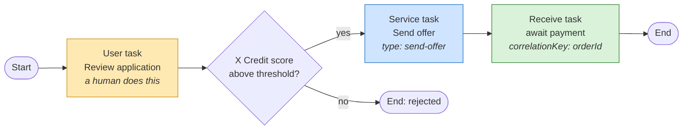

# LESSON-000 — What Camunda Is, and What Its Parts Do

Status: ready

Version scope: **Camunda 8.9** ([ADR-0002](../../adr/0002-camunda-8-version-pin.md)).
Evidence: [evidence.md](evidence.md). Continues into
[Lesson 001](../001-camunda7-8-mental-model/lesson.md).

Every claim is labelled:

- **Fact (8.9)** — stated by the official Camunda 8.9 documentation.
- **Observed** — actually seen running a 8.9.22 cluster on 2026-09-29; command and output
  in `evidence.md`.
- **Interpretation** — my reasoning. Not Camunda behaviour.

## Objective

Before comparing two products, you must be able to say what the *category* is, what the
*notation* is, what the *words* mean, and what each *part* of the system is for. This
lesson builds that base. It introduces no code and deploys nothing.

By the end you should be able to look at a Camunda 8 deployment and answer, for any
component you see: **what does it do, and what would break without it?**

## Context

Lesson 001 asks how Camunda 7 and Camunda 8 differ. That question is unanswerable unless
you already know what a process engine is, what a BPMN diagram actually is, and what a
"job worker" is. Those were never taught. This lesson fills that gap, in the order that
makes each step follow from the previous one instead of appearing from nowhere.

## Concept

Read these seven sections in order. Each one only uses words the previous one defined.

### 1. The problem that creates the need

A real business process — approve a loan, onboard a customer, ship an order — is not a
function call. It spans:

- **different systems** (a core banking system, a fraud service, an email provider),
- **different teams**, and sometimes **different companies**,
- **time** — it sits waiting for a human approval overnight,
- **failure** — any step can fail, and failing must not lose what came before.

Now try to write that as ordinary code, and something breaks immediately. A function call
returns or it throws. It cannot sit still for two days. It cannot be resumed on a
different machine. It cannot tell you, six months later, what happened. If the process is
sitting in a database write, the code has already returned — the code is gone, and
"where is this loan application right now?" is nobody's responsibility.

**That gap is the entire reason workflow engines exist.** Fact, not opinion: Camunda 8's
own introduction describes the product as being for "orchestrate and automate complex
business processes that include people, AI agents, systems, and devices" — note that
*people* and *devices* are in the list, alongside systems.

**What would break without the engine:** the wait. A function call cannot represent time.

### 2. The category: a workflow engine

A **workflow engine** is software that:

1. **stores the state** of a long-running business process,
2. **advances it one step at a time** according to a defined sequence,
3. **hands work to other parties** — a person, another system, a service.

The defining property, and the one to hold onto:

> **The state of the process outlives the code that started it.**

That is why the engine has to persist somewhere authoritative, and that is the *only*
reason the storage design is a big deal. It is also, as Lesson 001 will show, the reason
Camunda 7 and Camunda 8 made different storage choices: they were solving the same
requirement with different generations of technology.

**What would break without persistence:** step 3 of the definition. If state is only in
memory, the moment the process hands work to someone else, nothing is left to come back
to.

### 3. BPMN: a notation, and a standard one

**Fact (8.9).** BPMN is **not** a Camunda invention. BPMN 2.0 is a specification from the
**OMG** (Object Management Group), the same body that publishes UML. Camunda consumes
BPMN; it does not own it.

Why does a standard exist at all? Business reason, not technical one: a process diagram
drawn in a vendor-neutral notation can be read by the business, reviewed by compliance,
handed to a different vendor, and survive the engineer who drew it leaving the company.
The notation is the contract.

The notation has a small core vocabulary, and the official 8.9 documentation introduces
exactly three categories:

| Element | What it means | Reads as |
| --- | --- | --- |
| **Events** | Things that happen | "when this occurs" |
| **Tasks** | Units of work | "someone does this" |
| **Gateways** | Branching and merging | "if / and / join" |
| **Sequence flows** | The arrows | "then" |
| **Pools and lanes** | Who is responsible | "this swimlane is that team" |

**Observed:** none of this is in the running cluster, and it should not be. BPMN is a
*description*. The diagram is not executing. This is the crucial mental step, so let it
land before the next section.

### 4. The words everyone mixes up

This is the highest-value section of the lesson. Most confusion in Camunda 8 is one of
these eight words being used for the wrong thing.

**Fact (8.9), from the official service-task and receive-task documentation:**

| Word | What it actually is | Analogy | What breaks without it |
| --- | --- | --- | --- |
| **Process definition** | The deployed BPMN model. A template, versioned. | A class, or a recipe | Nothing to instantiate |
| **Process instance** | One real run of that definition, with its own state and data | An object, a transaction | You cannot tell two customers' runs apart |
| **Variable** | A named piece of data on an instance | A field | No data to act on |
| **Task** | A step in the diagram needing work | A to-do item | No unit of work |
| **User task** | A task a **human** completes, via Tasklist | A ticket | Humans cannot participate |
| **Service task** | A task **automation** performs, via a job | A durable API call | No automated step |
| **Job** | The *executable unit* created when a service task is entered | A message on a queue | Nothing for your code to pick up |
| **Job worker** | **Your code**, subscribing to a job type, doing the work | A queue consumer | Nobody performs the step |

The chain, stated explicitly, because this single line answers "why do I need a worker?":

> When a service task is entered, a **job is created**. The process instance **stops and
> waits**. A job worker **subscribes to the job type**, receives the job, does the work,
> and **completes the job**. Only then does the process instance continue.

**Fact (8.9).** The service task's `zeebe:taskDefinition` names the `type` that workers
subscribe to (for example `order-items`), and optionally `retries` (default three).
The receive task works the same way with a **message subscription** instead of a job:
`zeebe:subscription correlationKey="=orderId"`.

**Interpretation.** Notice what the process instance is doing while it waits: nothing. It
is *parked*, holding only its state. That is the whole design in one sentence — the engine
is a state machine that can be interrupted indefinitely, and a worker is just a program
that gets woken up when there is something to do.

**Observed — the strongest proof of the definition/instance split.** The cluster was
running with a healthy `LEADER` partition and a log past position 6400, and the process
instance count was **zero**:

```
$ curl -s -X POST -H 'Content-Type: application/json' -u demo:demo \
    -d '{"filter":{}}' http://localhost:8080/v2/process-instances/search
{"page":{"totalItems":0,"hasMoreTotalItems":false,"startCursor":null,
  "endCursor":null},"items":[]}
```

A running engine and an absent business process are independent facts. The records in
that log were cluster bookkeeping, not customer work.

### 5. So what is Camunda?

**Fact (8.9).** Camunda is a vendor that builds workflow and decision automation. It takes
BPMN as input and runs it. The current generation is **Camunda 8**, built around **Zeebe**,
described in the official docs as "a distributed workflow and decision engine that
replaces a traditional relational database with an event streaming, message-based
architecture".

Camunda **7** is the earlier generation, built on a traditional relational database.

**Interpretation — and this is the point to take away.** Camunda 7 and Camunda 8 share
the **notation** and the **concepts** (definition, instance, task, service task) and
almost nothing about the **engine**. So when someone asks "what is the difference between
7 and 8?", the honest answer starts with: the vocabulary is the same, the machinery is
not. That is Lesson 001.

One caution, because you will meet this framing a lot. The phrase "replaces a traditional
relational database" is **vendor framing**, and it is looser than the architecture. In the
very cluster described in the Fact above, there *is* a relational database — see the next
section. Reading marketing as architecture is how people end up believing Camunda 8 has
no database, which is false and which Lesson 001 demonstrates empirically.

### 6. The parts of Camunda 8, and why each one exists

This is the section that removes the magic. A component list is trivia. A component list
where each item is **forced by a constraint** is understanding.

**Observed** the following in the local 8.9.22 cluster:

| Component | What it does | Why it must exist | Live proof |
| --- | --- | --- | --- |
| **Broker (Zeebe)** | Runs process instances. Owns the state. | The state must survive code, restarts and machines. It has to be somewhere. | `/actuator/partitions` → partition `1`, `role: LEADER` |
| **Gateway** | Front door. Routes commands to the right partition. | You cannot expose every broker directly; clients need one stable address, and only a gateway can route by key. | `/v2/topology` reports `gatewayVersion` *and* broker `version` — two layers |
| **Operate** | Monitoring, incident management | A distributed engine will have incidents. Somebody must be able to see and act. | `200` on `/operate` |
| **Tasklist** | The queue of work for humans | Humans need a work surface, not an API | `200` on `/tasklist` |
| **Connectors** | Outbound integration to external systems | Every SaaS integration would otherwise be bespoke code | `connectors` container `healthy` |
| **Primary storage** | The log itself | One writer per partition, cheap replication, replay after restart | `processedPosition`, `raft-partition/…/*.sst`, `zeebe.metadata` |
| **Secondary storage** | Projection for querying history | Asking questions about history with SQL is genuinely useful — but it must not be the truth | `/actuator/exporters` → `rdbms ENABLED`; `exportedPosition`; `h2db.mv.db` |
| **Zeebe extensions** | `zeebe:taskDefinition`, `zeebe:subscription` | A pure diagram cannot say *which* job type, or *which* correlation key | Documented, 8.9; nothing deployed in this lesson |

**Interpretation.** Read the "why" column and notice that no component exists because it
is a feature. Each one is the answer to a problem: state must be durable → broker. Clients
need one address and routing → gateway. Distributed systems fail → Operate. Humans are
involved → Tasklist. History needs querying → secondary storage. Integration is
repetitive → Connectors. And BPMN alone is ambiguous about job types → the `zeebe:`
namespace.

If you can reconstruct the "why" column, you did not memorise the list. That is the whole
test.

### 7. The log, in one picture

The word "log" sounds technical, so let me make it concrete.

**Observed.** A partition reports a position, and it only moves forward:

```
sample 1 @ 18:05:08: processedPosition=6419 exportedPosition=6418
sample 2 @ 18:05:20: processedPosition=6435 exportedPosition=6436
sample 3 @ 18:05:32: processedPosition=6443 exportedPosition=6444
```

So: the log is a **numbered, ordered sequence of records**. Record 6435 is at position
6435. A **position** is just an integer offset into that sequence. Nothing more mystical.

Why a log rather than a table?

- **Append-only** — writing is cheap and never has to update rows in place.
- **Ordered** — position order *is* causal order, so "what happened before what" is free.
- **Replayable** — the engine can rebuild its in-memory state by reading from 0, or from
  the last **snapshot**. `snapshotId` in the evidence is that shortcut.
- **Replicable** — shipping a stream of appends to followers is far simpler than
  replicating a table with conflicts.
- **Cheap to snapshot** — `processedPosition=6403` with a snapshot at 6393 means restart
  replays ~10 records, not 6403.

**Fact (8.9).** Camunda's own documentation names this *primary storage*: "the
authoritative store for workflow execution state managed by the Orchestration Cluster. In
Self-Managed deployments, Zeebe brokers persist partition logs and snapshots on local
disk." The database side is *secondary storage*, and the two are configured separately
(`camunda.data.secondary-storage`).

**Observed** — the two, side by side, as different directories in different volumes:

| | Primary storage | Secondary storage |
| --- | --- | --- |
| Path | `/usr/local/camunda/data/raft-partition` | `/usr/local/camunda/camunda-data` |
| Contents | `*.sst`, `MANIFEST-*`, `zeebe.metadata` | `h2db.mv.db`, `h2db.trace.db` |
| Fed by | The broker, directly | The `RdbmsExporter` |
| Own position | `processedPosition` | `exportedPosition` |
| Queried with SQL | No | Yes |
| If you delete it | **You lose process state** | You lose history projections; rebuildable |

**Interpretation — why this is worth the complexity.** Because the two are separate and
only one is authoritative, the system gets a property a single-database design cannot
have: a broken, slow or full database degrades *visibility* without stopping *execution*.
That is the trade Lesson 001 examines properly, including what it costs.

**Observed — routing.** The cluster reports how a message finds its partition:

```
"routing":{"requestHandling":{"strategy":"AllPartitions","partitionCount":1},
           "messageCorrelation":{"strategy":"HashMod","partitionCount":1}}
```

**Interpretation.** `HashMod` means the correlation key is hashed modulo the partition
count. Two consequences follow immediately: a process instance's events always land in
the same partition, and the partition count cannot be casually changed once data exists.
Lesson 002 goes deeper.

## Camunda 7 → 8

Deliberately short — that comparison is [Lesson 001](../001-camunda7-8-mental-model/lesson.md).
The only thing to take from here:

| | Camunda 7 | Camunda 8 |
| --- | --- | --- |
| Notation | BPMN | BPMN (same) |
| Concepts | definition, instance, task, service task | Same names |
| Engine | Database-backed | Log-backed, distributed |
| What this lesson taught you | — | Everything above |

## Minimal example

No runnable code — the minimal example here is a **BPMN shape** and a **chain**, both
drawn rather than deployed.



Read it with the vocabulary above: a **user task** is a human step; a **service task**
becomes a **job** of type `send-offer` that a **job worker** must pick up; a **receive
task** parks the instance until a **message** correlated by `orderId` arrives. The process
instance advances only as each of those completes.

**No BPMN file was deployed.** This is a diagram in a document, not a process running in
the cluster. That distinction is the point of section 3.

## Implementation

None. This lesson is documentation. Deliverables:

- `docs/lessons/000-camunda-bpmn-concepts/lesson.md` — this document.
- `docs/lessons/000-camunda-bpmn-concepts/evidence.md` — the read-only observations.
- `docs/modules/00-orientation/README.md` — module registration.
- `specs/000-camunda-bpmn-concepts/` — the specification behind it.

The running cluster was reused as-is, started by
[`infra/local/README.md`](../../../infra/local/README.md).

## Execution

Read-only. No deployment, no state change.

```bash
cd infra/local/camunda-8.9
docker compose ps
curl -s http://localhost:8080/v2/topology
curl -s http://localhost:9600/actuator/exporters
curl -s http://localhost:9600/actuator/partitions
curl -s http://localhost:9600/actuator/cluster
docker compose exec -T orchestration ls -1R /usr/local/camunda/data
docker compose exec -T orchestration ls -lh /usr/local/camunda/camunda-data
curl -s -X POST -H 'Content-Type: application/json' -u demo:demo \
  -d '{"filter":{}}' http://localhost:8080/v2/process-instances/search
```

Headline results: broker and gateway both `8.9.22`; one exporter, `rdbms`, `ENABLED`;
partition `1` is `LEADER` with `exporterPhase: EXPORTING`; the log position advanced
6419 → 6443 in 24 seconds; two storage directories in two volumes; **zero** process
instances. Full output in [evidence.md](evidence.md).

## Failure / investigation / correction

Two real dead ends, both recorded in `evidence.md` rather than hidden.

**Dead end 1 — the old API.** I looked for process instances at `/v1/processes` and got
`404`. The v1 API is gone; 8.9 uses `/v2/…`, and the instance endpoint is a **`POST`
search**, not a `GET` list. Getting a `404` here would have been easy to misreport as
"the engine has no processes".

**Dead end 2 — a `200` that meant nothing.** `GET /operate/v2/processes` returned
`200`, and a status-code-only check would have recorded "processes endpoint working".
The body was `<!doctype html>` — the Operate single-page app answering a route, not an
API. Asserting only on status codes is how a check turns a non-fact into a recorded fact.

**Correction applied to how I reason here.** Every component claim in section 6 points at
a command that returns the *substance* — a leader role, a position, a file path, an
`ENABLED` exporter — rather than at a `200`. The `200`s appear in the evidence as proof of
reachability and nothing more.

**Carried forward.** The deeper version of this lesson is in
[Lesson 001](../001-camunda7-8-mental-model/lesson.md), where the claim "Camunda 8 has no
database" is stated, then refuted by the running system, and replaced with a model about
roles. This lesson contains the vocabulary that correction depends on.

## Architecture implications

- **The engine owns state, so the engine is a critical dependency.** When you ask "what
  breaks if this is down", the answer for a broker is "processes stop". Everything else in
  the stack is downstream of that.
- **Read surfaces can degrade independently.** Operate and Tasklist read the projection,
  not the log. They can be stale or empty while execution is perfectly healthy. Anyone
  debugging a system must know which surface they are looking at.
- **Latency has two sources.** The log is fast; the projection is `flushInterval`-bound
  (`PT0.5S` here). "The UI is behind" is usually the exporter, not the engine.
- **A worker is the real integration boundary.** Because a job leaves the engine, every
  side effect a worker performs is outside the engine's transaction. That is the root of
  every idempotency problem in this course, and it starts here, at "service task creates a
  job".
- **Partition count is an architectural decision, not a tuning knob.** `HashMod` routing
  means changing it re-hashes every correlation key. Choose it with the expected key
  distribution in mind.
- **One trade, stated plainly.** The log design buys horizontal scale and removes the
  database as a bottleneck. It costs you SQL over live state, forces you to reason about
  replay, and makes "which database do I back up" a question with two answers.

## Interview questions

**Q. What is BPMN and who owns it?**
*A.* A notation for business processes, specified by the **OMG** — not a Camunda
invention. It exists so a process diagram is vendor-neutral, business-readable and
durable across staff changes. Camunda consumes it and extends it with a `zeebe:`
namespace for execution details the standard has no slot for.

**Q. Difference between a process definition and a process instance?**
*A.* The definition is the deployed, versioned template. The instance is one real run
with its own state and variables. Observed proof that these are independent: a healthy
`LEADER` partition with a log past position 6400 and **zero** instances.

**Q. Walk me through a service task.**
*A.* Entering it creates a **job** with the `type` from `zeebe:taskDefinition`. The
instance stops and waits. A **job worker** subscribed to that type receives the job, does
the work, and completes it; then the instance continues. The worker is your code, out of
process, over gRPC.

**Q. What is a workflow engine for, in one sentence?**
*A.* To store the state of a long-running business process, advance it step by step, and
hand work to other parties — so the process survives the code, the machine and the
outage that started it.

**Q. Why is a log used instead of a database?**
*A.* Append-only writes are cheap, position order is causal order, replay from a snapshot
makes restart fast, and shipping appends replicates more simply than replicating a table.
Observed: a snapshot at 6393 with the log at 6403 means restart replays about ten records.

**Q. What does the gateway do, and why not call a broker directly?**
*A.* Clients need one stable address, and only the gateway can route a command to the
partition that owns a key. Observed: `/v2/topology` reports a gateway version and a
broker version separately.

**Q. Camunda 8 has no database — right?**
*A.** No, and it's the most common wrong answer in interviews. There is a database; it is
**secondary storage**, written by the `RdbmsExporter`, and it is a rebuildable projection.
Observed: one exporter `rdbms` `ENABLED`, a database file on disk, and a second position
`exportedPosition` tracking the log's `processedPosition`. The claim that holds is "no
database as the source of truth".

**Q. Operate is empty. Where do you look?**
*A.** Compare the two positions from `/actuator/partitions`. If `processedPosition` is
climbing and `exportedPosition` is stalled, the exporter is behind and the UI is stale
while execution is fine. Only if the log itself is stalled is the engine in trouble.

**Q. Why does the partition count matter?**
*A.* Because `messageCorrelation.strategy: HashMod` routes by hashing the correlation key
modulo the partition count. Changing it re-hashes every key. It bounds concurrency and is
a data-distribution decision, not a performance knob.

**Q. Components — and why each exists?**
*A.* Broker for durable state; gateway for one address plus key-based routing; Operate
because distributed systems have incidents; Tasklist because humans need a work queue;
secondary storage because history is worth querying with SQL; Connectors because
integration is repetitive. **Interpretation:** a candidate who can regenerate the "why"
list has understood the system; one who recites the list has memorised a screenshot.

**Q. How would you explain Camunda 8 to a colleague who only knows Camunda 7?**
*A.* Same vocabulary, same notation, different engine. In 7 the database holds the running
state. In 8 a replicated log holds it, your code pulls jobs over the network instead of
being called in-process, and the database became a queryable projection of that log. The
consequence to warn them about: work now crosses a network boundary, so at-least-once
delivery is the normal case, not an edge case.

## Evidence

- [evidence.md](evidence.md) — verbatim output, including the two dead ends.
- [Lesson 001](../001-camunda7-8-mental-model/lesson.md) — the C7 → 8 comparison.
- [ADR-0002](../../adr/0002-camunda-8-version-pin.md) — the 8.9.x pin.
- [SPEC-000](../../../specs/000-camunda-bpmn-concepts/spec.md) — scope and constraints.

## Completion criteria

- [x] Concept understood — problem, category, notation, vocabulary, product, components,
      log, in causal order
- [x] Mental model explained — "what would break without it" for every term, and a
      constraint-derived reason for every component
- [x] Relevant C7 → 8 distinction documented — deferred to Lesson 001, pointed to
- [x] Scope defined by SPEC — [SPEC-000](../../../specs/000-camunda-bpmn-concepts/spec.md)
- [x] Experiment implemented when applicable — read-only inspection of a live cluster
- [x] Tests executed — N/A by design; this lesson writes no code and deploys no process.
      Verification is observation of the running cluster. No tests were invented.
- [x] Failure path investigated when relevant — the `/v1` 404 and the SPA 200 false
      positive
- [x] Findings documented from actual execution
- [x] Architecture implications documented
- [x] Interview review completed — Q&A above
- [ ] Independent review completed

## Not yet true about this lesson

It is `ready`, not `completed`. The honest open questions for a reviewer: whether the
causal ordering actually helps a reader who has never seen an engine, whether the
component table's "why" column is derivable rather than plausible, and whether a lesson
with no deployed BPMN earns its place — or whether the notation should be demonstrated by
running something.
