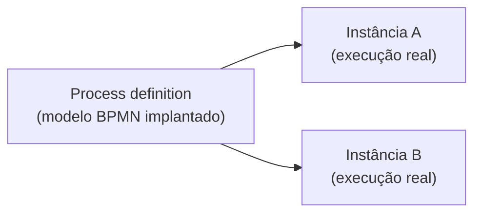
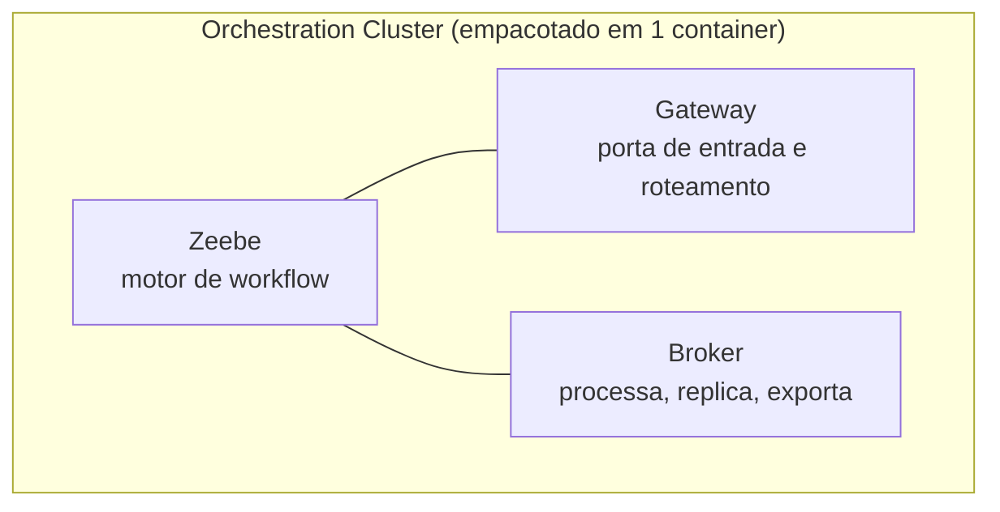
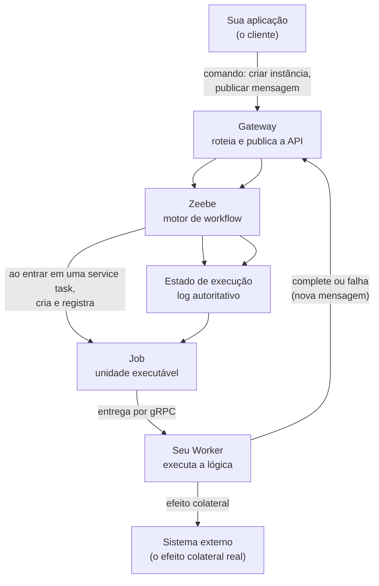
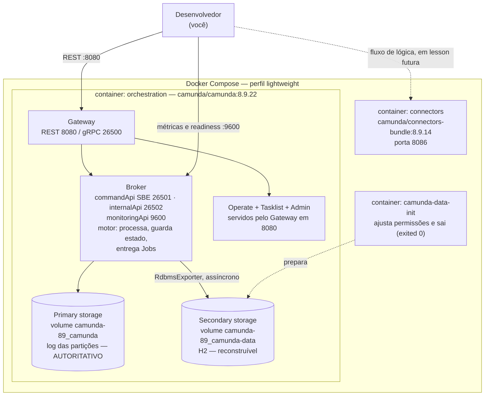

# LESSON-001 — Onde esses conceitos vivem dentro do Camunda 8

Status: ready

Escopo de versão: **Camunda 8.9.x** ([ADR-0002](../../adr/0002-camunda-8-version-pin.md)),
verificado em um cluster `8.9.22`.
Evidência: [evidence.md](evidence.md).
Conhecimento: [Camunda 7 vs 8](../../camunda/camunda-7-vs-8.md) ·
[Mapa de componentes do laboratório](../../camunda/camunda-8-local-components.md).

**Pré-requisito: [Lesson 000 — Processo BPMN, instância, task, Job e Worker](../000-camunda-bpmn-concepts/lesson.md).**
Você já sabe o que é um *process definition*, uma *process instance*, uma *service task*, um
*Job* e um *Job Worker*. Esta lesson não repete esse vocabulário. Ela responde a pergunta que a
Lesson 000 deixou em aberto: **onde essas coisas vivem dentro do Camunda 8?**

## Objetivo

Construir o Camunda 8 mentalmente, componente por componente, **antes** de falar de
persistência. Ao final você deve ser capaz de, em um papel, desenhar o caminho de um comando
da sua aplicação até o efeito colateral em um sistema externo, e nomear cada peça.

Esta lesson não começa por "onde o estado é salvo". Ela começa por "quem faz o quê".

## Contexto

Existe uma tentação permanente de explicar Camunda 8 pela persistência: *"o 7 usa banco, o 8 usa
log"*. Essa frase é verdadeira e insuficiente. Quem aprende só isso decora a frase e continua
incapaz de responder "se eu tiver uma aplicação Java amanhã, onde ela entra?".

Por isso a ordem aqui é inversa. Primeiro os componentes, com o que cada um faz e o que **não**
faz. Só depois a persistência, e só porque agora existe algo concreto onde ela se pendura.

## Roteiro

| # | Seção | Pergunta que responde |
|---|---|---|
| 1 | [BPMN no contexto do runtime](#1-bpmn-no-contexto-do-runtime) | O diagrama vira o quê? |
| 2 | [Camunda 8 Self-Managed](#2-camunda-8-self-managed) | O que é isso que estamos rodando? |
| 3 | [Zeebe](#3-zeebe) | O que é o Zeebe? |
| 4 | [Gateway](#4-gateway) | Qual a responsabilidade do Gateway? |
| 5 | [Broker](#5-broker) | Qual a responsabilidade do Broker? |
| 6 | [Estado de execução](#6-estado-de-execução) | O que realmente é o "estado"? |
| 7 | [Job](#7-job) | Onde o Job vive? |
| 8 | [Worker](#8-worker) | Quem executa a lógica? |
| 9 | [Aplicação cliente](#9-aplicação-cliente) | Como minha aplicação conversa com isso? |
| 10 | [Componentes operacionais e UI](#10-componentes-operacionais-e-ui) | O que é Operate, Tasklist, Admin? |
| 11 | [Ambiente local real](#11-ambiente-local-real) | O que está rodando aqui? |
| 12 | [Docker Compose](#12-docker-compose) | Como isso sobe? |
| 13 | [Onde entra o H2?](#13-onde-entra-o-h2) | Por que há um banco, e o que ele é? |
| 14 | [O modelo Camunda 7 → 8](#14-o-modelo-camunda--8) | O que mudou conceitualmente? |

---

## 1. BPMN no contexto do runtime

### O que é

Um **process definition** é um modelo BPMN implantado. No Camunda 8 ele é implantado no
**Orchestration Cluster** e passa a existir como versão.

### Responsabilidade

O definition é a *receita*. Ele não executa nada sozinho. Quando alguém cria uma instância, o
motor a interpreta passo a passo.

### O que NÃO faz

O definition **não** guarda estado de execução. Ele é imutável por versão. Se você consultar o
estado de um processo, você não está olhando para o definition — está olhando para a instância,
que é a *execução real*.

### Como se relaciona



**Observado.** Um cluster com partição `LEADER` saudável, log na posição 6400+, e **zero**
instâncias. Um definition pode existir e nenhuma execução estar em curso.

### Evidência

Cluster saudável com `totalItems: 0` em `/v2/process-instances/search`. Detalhes em
[evidence.md](evidence.md).

---

## 2. Camunda 8 Self-Managed

### O que é

**Fato (8.9).** *Self-Managed* é a forma de implantação em que **você** opera a plataforma: você
escolhe a infraestrutura, sobe os componentes e os mantém. O Camunda 8 SaaS é a alternativa, em
que a Camunda opera por você.

O laboratório usa **Self-Managed via Docker Compose**, perfil *lightweight*.

### Atenção: "Camunda 8 Run" não é o mesmo produto

Essa confusão é frequente e você vai encontrá-la. Não são sinônimos.

| | **Camunda 8 Self-Managed (Docker Compose)** | **Camunda 8 Run** |
|---|---|---|
| Natureza | Topologia de containers | Distribuição local com binários, scripts de inicialização e *launcher* |
| Como sobe | `docker compose up -d` | `c8ctl cluster start <versão>` ou `camunda-start.sh` |
| Java no host | Não precisa — o Java está dentro da imagem | Precisa: **Fato (8.9):** exige OpenJDK 21–25 |
| Estabilidade em 8.9 | Caminho oficial documentado | Marcado como **Experimental** na 8.9 |
| Para produção | É o caminho suportado para infraestrutura própria | **Não.** A doc diz: "not intended for production use" |

**Fato (8.9).** A documentação do Camunda 8 Run lista o que ele inclui: *Orchestration Cluster*,
*Connectors* e **H2 como *secondary storage* padrão**. É essa sobreposição de conteúdo — o
mesmo trio — que faz as pessoas chamarem um pelo nome do outro. O que os distingue é **como ele
sobe**, não o que ele contém.

### O que este laboratório usa

**Observado.** O artefato versionado em `infra/local/camunda-8.9/` é o
`docker-compose.yaml` *lightweight* do release oficial `docker-compose-8.9`, e o `README.md`
upstream que o acompanha tem como título **"Camunda 8 Self-Managed - Docker Compose"**.

Portanto: o termo correto para o que roda aqui é **Camunda 8 Self-Managed (Docker Compose)**.
**Camunda 8 Run não é o que este laboratório usa.**

### O que NÃO é

Self-Managed não significa "versão da Community". Significa "operação por sua conta". A distinção
é de responsabilidade operacional, não de edição.

### Evidência

Título do `README.md` upstream vendorizado; `docker compose ps`; versão `8.9.22` em ambos os
containers. Ver [infra/local/README.md](../../../infra/local/README.md).

---

## 3. Zeebe

### O que é

**Fato (8.9).** Zeebe é o **motor de automação de processos** do Camunda 8. Ele é o componente
que executa *process instances*.

Zeebe é um nome de componente, não um serviço isolado. No Camunda 8, Zeebe é um conjunto de
componentes que trabalham juntos — o **Broker** e o **Gateway** — e que são empacotados juntos
com Operate, Tasklist e Admin no que a documentação chama de **Orchestration Cluster**.

### Responsabilidade

Zeebe mantém o estado de execução, avança a instância passo a passo, cria **Jobs** quando encontra
uma *service task*, e entrega esses Jobs aos **Workers**.

### O que NÃO faz

- Zeebe **não** executa a lógica de negócio da sua empresa. Isso é o Worker.
- Zeebe **não** é a interface que o humano usa. Isso é Operate e Tasklist.
- Zeebe **não** é um container. Ver seção 11.

### Como se relaciona



**Interpretação.** Note a implicação: dizer "Zeebe" sem dizer qual parte é ambíguo. "Zeebe
guarda o estado" é verdadeiro do Broker; "Zeebe recebe comandos" é verdadeiro do Gateway.

### Evidência

`/v2/topology` devolve `gatewayVersion` **e** a versão do broker como campos separados — duas
camadas distintas, uma só imagem. Ver [evidence.md](evidence.md).

---

## 4. Gateway

### O que é

**Fato (8.9).** O Zeebe Gateway é o *ponto de contato* do cluster Zeebe: é por ele que os
clientes Zeebe se comunicam com os brokers.

### Responsabilidade

- **Rotear** cada comando para a partição que é dona da chave relevante.
- **Publicar** uma API estável (REST em `/v2/…` e gRPC em `26500`), para que o cliente nunca
  precise conhecer o endereço interno de um broker.
- **Servir as interfaces web** no 8.9.

**Fato (8.9).** Nas notas de release do 8.9: os perfis de aplicação de Operate, Tasklist e
Identity foram fundidos ao perfil do gateway, e **"these components are now treated as UIs served
by the Zeebe Gateway"**, controláveis por `camunda.webapps.enabled`.

**Fato (8.9).** A definição oficial do Gateway, verbatim: *"A gateway serves as a single entry
point to a Zeebe cluster and forwards requests to brokers. The gateway is stateless and
sessionless, and gateways can be added as necessary for load balancing and high availability."*

Repare em duas palavras: **stateless and sessionless**. O Gateway não guarda nada. Ele é
descartável — você pode adicionar mais para balanceamento e alta disponibilidade, e nada se
perde. Um componente que guarda estado não pode ser qualquer um.

### O que NÃO faz

**Fato (8.9).** O Gateway **não processa** e **não guarda estado**. A doc de partições é
explícita sobre quem faz o trabalho: *"This leader accepts requests and performs event
processing for the partition"* — quem aceita requisições e processa é o **broker líder**. E os
followers *"maintain a copy of the partition **without performing event processing**"*.

Logo, o processamento é um papel do **Broker**, nunca do Gateway. Se você diz "Zeebe é
stateless" e "Zeebe guarda o estado", você está descrevendo dois componentes diferentes com o
mesmo nome.

Confundir Gateway com Broker é o erro mais comum aqui. Se você chama o Gateway de "o engine",
está errado: o engine é o Broker.

### Como se relaciona

O Gateway é a única porta que a aplicação cliente enxerga. O Broker é onde o trabalho acontece.

### Evidência

**Observado.** As três interfaces respondem na **mesma** porta `8080`, servidas pelo Gateway:
`/operate` → `<title>Operate</title>`, `/tasklist` → `<title>Tasklist</title>`, `/admin` →
`<title>Camunda Admin</title>`.

E `/actuator/configprops` reporta, sob o bean
`camunda.webapps-io.camunda.webapps.WebappsModuleConfiguration$WebappsProperties`:

```json
{"loginDelegated": false, "enabled": true, "defaultApp": "operate"}
```

Um único `enabled: true` para as três interfaces, e `defaultApp: operate` — o mesmo bean
governa Operate, Tasklist e Admin, que é o que a imagem unificada implica.

### Sobre o papel no roteamento

**Observado.** O cluster reporta duas estratégias de roteamento distintas:
`requestHandling: {strategy: AllPartitions, partitionCount: 1}` e
`messageCorrelation: {strategy: HashMod, partitionCount: 1}`.

**Interpretação.** São coisas diferentes e ambas importantes. Um **comando** pode ser encaminhado a
todas as partições, enquanto uma **mensagem** é roteada por hash da *correlation key* módulo o
número de partições. Consequência: os eventos de uma instância caem sempre na mesma partição, e
mudar a contagem de partições re-distribui todas as chaves. Volto a isso na seção 14.

> ⚠️ **O que este cluster NÃO demonstra.** Com `partitionCount: 1`, `AllPartitions` e `HashMod`
> degeneram no mesmo destino. Este ambiente **não** prova a diferença de comportamento entre as duas
> estratégias — prova apenas que elas existem e são independentes. Qualquer conclusão aqui sobre
> *"o que acontece quando há várias partições"* vem da **documentação**, não de observação. Ver
> [evidence §5](../001-camunda7-8-mental-model/evidence.md).
>
> **Experimento que fecharia a lacuna:** subir o cluster com `partitionsCount: 2` e repetir a
> leitura de `/actuator/cluster`. Adiado — ver "O que ainda não é verdade sobre esta lesson".

---

## 5. Broker

### O que é

**Fato (8.9).** *"The Zeebe Broker is the distributed workflow engine that tracks the state of
active process instances. Brokers can be partitioned for horizontal scalability and replicated for
fault tolerance."*

Traduzindo: o Broker é o **engine** propriamente dito. Partições dão escalabilidade horizontal;
replicação dá tolerância a falhas. São dois motivos independentes, e por isso a topologia do
cluster leva as duas decisões.

### Responsabilidade

A doc oficial lista as responsabilidades do Broker de forma **exaustiva** — três itens, e só três:

1. *"Processing commands sent by clients"*
2. *"Storing and managing the state of active process instances"*
3. *"Assigning jobs to job workers"*

Se algo não está nessa lista, não é responsabilidade do Broker.

### O que NÃO faz

E aqui está a frase mais importante desta seção, verbatim:

> *"It's important to note that **no application business logic lives in the broker**."*

Não é uma convenção nem uma recomendação. É uma propriedade declarada da arquitetura. O Broker
**não** executa a lógica de negócio, e o Broker **não** é o ponto de contato do cliente — quem
fala com o cliente é o Gateway.

Essa frase é o que separa o Camunda 8 de um ORM com scheduler, e é a base da seção 14.

### Como se relaciona

É o destino final do comando que saiu do Gateway, e a origem do registro que o *exporter*
publica no armazenamento secundário.

### Evidência

**Observado.** `/v2/topology`: partição `1`, `role: leader`, `health: healthy`, broker em
`172.21.0.2:26501`. `/actuator/partitions`: `role: LEADER`, `streamProcessorPhase: PROCESSING`,
`exporterPhase: EXPORTING`.

---

## 6. Estado de execução

### O que é

O estado de execução é o conjunto de tudo que precisa existir para que uma instância possa ser
retomada: em que passo está, quais variáveis tem, quais Jobs estão pendentes.

**Fato (8.9).** A documentação do Camunda chama esse estado de **primary storage**, e a definição
é precisa: *"The authoritative store for runtime execution state used by the Orchestration Cluster
to execute, recover, and replicate workflows. This includes partition logs and snapshots and is
tightly coupled to process execution."*

E, sobre onde ele vive, a mesma documentação é direta: *"Zeebe (the workflow engine inside Camunda
8) writes data directly to the file system on the same servers where it is deployed."* Nada de
banco relacional no caminho do estado de execução.

### O que é na prática: um log

**Observado.** Uma partição reporta posições, e elas só avançam:

```text
processedPosition: 9399    exportedPosition: 9400
snapshotId: 9170-1-9237-9238-0-739727fe      processedPositionInSnapshot: 9237
```

A **posição** é só um inteiro que indica o deslocamento na sequência de registros. O registro
6435 está na posição 6435. Não há nada de místico.

E o snapshot existe de verdade, no disco, com o mesmo identificador que o actuator reporta:

```text
/usr/local/camunda/data/raft-partition/partitions/1/
  raft-partition-partition-1-1.log          128 MB pré-alocado, append-only
  raft-partition-partition-1.meta           metadados da partição
  raft-partition-partition-1.conf
  snapshots/9170-1-9237-9238-0-739727fe/    o snapshot que cobre até a posição 9237
  runtime/000083.sst …                      RocksDB: o estado materializado
```

Por que um log e não uma tabela?

- **Append-only** — escrever é barato e nunca precisa atualizar linhas no lugar.
- **Ordenado** — ordem de posição *é* ordem causal; "o que aconteceu antes de quê" é de graça.
- **Reproduzível** — o motor reconstrói o estado relendo do log, ou do último **snapshot**, e
  depois materializa em `runtime/*.sst` (RocksDB). Com `processedPosition` 9399 e snapshot
  cobrindo até 9237, um restart reproduz ~162 registros, não 9399.
- **Replicável** — enviar um fluxo de appends para followers é muito mais simples do que
  replicar uma tabela com conflitos.

### Comparação direta com o armazenamento secundário

| | Primary storage | Secondary storage |
| --- | --- | --- |
| Caminho | `/usr/local/camunda/data/raft-partition` | `/usr/local/camunda/camunda-data` |
| Conteúdo | `raft-partition-partition-1-1.log`, `snapshots/`, `runtime/*.sst` | `h2db.mv.db`, `h2db.trace.db` |
| Alimentado por | O Broker, diretamente | O `RdbmsExporter` |
| Posição própria | `processedPosition` | `exportedPosition` |
| Autoritativo? | **Sim** | Não |
| Se você apagar | **Perde o estado dos processos** | Perde projeções; reconstruível a partir do log |

**Observado.** São **dois diretórios em dois volumes diferentes** do mesmo container.

### O que NÃO é

O estado de execução **não é** uma linha em uma tabela de um banco relacional. É um log
replicado. Essa diferença não é cosmética: é o que permite escala horizontal e o que torna a
recuperação um problema de *replay*, não de *restore* de tabela.

### A diferença que a seção 14 usa

**Interpretação.** Guarde a distinção: o log é **autoritativo**; o banco é uma **projeção
reconstruível**. Quase toda a confusão de C7 → C8 vem de tratar esses dois como o mesmo tipo de
coisa.

---

## 7. Job

### O que é

Recapitulando a Lesson 000: ao entrar em uma *service task*, o motor cria um **Job** — a unidade
executável. Você já sabe o que ele é. Aqui importa **onde ele vive**.

### Onde o Job vive

O Job é um **registro no log da partição**. Não é uma linha em uma tabela, não é uma mensagem em
um broker de mensagens, não é um item em uma fila na memória.

Ele é um fato que **aconteceu** e que está em uma posição específica do log.

### Consequência

**Interpretação.** É por isso que o Job sobrevive a um crash: ele já está no log replicado. É por
isso que ele pode ser reentregue: se o Worker não confirmar antes do prazo, o Job volta. E é por
isso que uma mudança no estado da instância é **atômica e durável** no momento em que o Job é
criado.

O que o Job **não** é: uma chamada dentro da sua transação de aplicação. Ele está do outro lado
de uma fronteira de rede. Volto a isso na seção 14, porque é a tese da lesson.

### Evidência

**Observado.** `/actuator/partitions` expõe a fase de *stream processor* (`PROCESSING`) e a fase
de *exporter* (`EXPORTING`) — o motor escrevendo no log e o exporter publicando, em paralelo.
O cluster não tinha Jobs pendentes, porque nenhuma instância existia.

---

## 8. Worker

### O que é

**Fato (8.9).** *"A job worker is a Zeebe client that uses the client API to first activate jobs,
and upon completion, either complete or fail the job."*

Repare em **"is a Zeebe client"**. O Worker não é uma peça da plataforma. Ele é um
**cliente** — a mesma categoria de coisa que a sua aplicação. Em Java, será um programa seu
usando o *Camunda client* ou o *Spring Boot Starter*.

E a doc lista explicitamente "carry out business logic" entre as responsabilidades do
**cliente**, junto com "deploy processes", "start process instances" e "publish messages". A
lógica de negócio é do cliente, por definição.

### Responsabilidade

1. **Ativar** Jobs do seu *job type* (*activate jobs*).
2. **Executar** a lógica de negócio.
3. **Completar** ou **falhar** o Job (*complete or fail*), para que o engine aplique a política de
   retry.

### O que NÃO faz

O Worker **não** é o engine. Ele **não** decide o próximo passo do processo; ele reporta o
resultado, e o engine decide. Ele **não** controla a transação do engine: a conclusão do Job é
uma nova mensagem, assíncrona, separada do que ele acabou de fazer no banco da sua empresa.

Esse último ponto é o mais importante da lesson e o motivo dela existir.

### Onde o Worker roda

**O Worker não está no cluster.** Ele é uma aplicação sua, em outro processo, em outra máquina,
falando gRPC na porta `26500`.

### Evidência

**Observado.** Nenhum container do laboratório executa lógica de negócio. Os dois containers em
execução são plataforma; o seu código é a terceira peça, e ela **não existe ainda** — por
decisão de escopo, ela é diferida para uma lesson futura.

---

## 9. Aplicação cliente

### O que é

Sua aplicação é o **cliente**. Ela conversa com o Orchestration Cluster pelo Gateway, usando as
APIs REST (`/v2/…`, porta `8080`) ou gRPC (porta `26500`).

### O caminho conceitual completo

Este é o diagrama fundamental desta lesson. Ele responde a pergunta *"se eu tiver uma aplicação
Java amanhã, onde ela entra?"* e *"quem realmente executa a lógica?"*. Ele é **conceitual**:
não mostra containers, portas nem volumes.



### O diagrama mais importante da lesson

Três coisas para retirar dele:

1. **Sua aplicação nunca toca no estado.** Ela emite comandos; o engine decide o que isso
   significa.
2. **A seta de volta do Worker é uma segunda mensagem.** Não é um retorno de chamada. O Worker
   terminou; agora ele *conta* ao engine que terminou, por outra conexão.
3. **A seta para o sistema externo é a única que causa efeito no mundo.** E ela está **fora** de
   qualquer controle transacional do engine.

### O que NÃO é

Sua aplicação **não** compartilha transação com o engine. Não existe "commit conjunto". Ver
seção 14.

### Evidência

**Observado.** A API está aberta sem credencial no perfil *lightweight*
(`unprotectedApi: true`): `POST /v2/process-instances/search` sem autenticação devolveu `200` com
zero instâncias. Ver [evidence.md](evidence.md).

---

## 10. Componentes operacionais e UI

### O que é

Além do motor, o Orchestration Cluster inclui componentes para **operar** e para **humanos
participarem**.

**Fato (8.9).** O Orchestration Cluster inclui:

| Componente | O que é | Quem usa | Executa processos? | Necessário para o engine executar? |
| --- | --- | --- | --- | --- |
| **Zeebe** | Motor de workflow | o sistema | **Sim** | **Sim** |
| **Operate** | Monitoramento e troubleshooting de instâncias | quem opera | Não | Não |
| **Tasklist** | Interface para *user tasks* (atribuir, completar) | quem é humano no processo | Não | Não |
| **Admin** (antigo *Orchestration Cluster Identity*) | Autenticação e autorização integradas | quem administra | Não | Não |
| **APIs** | Programação contra o cluster | aplicações e ferramentas | Não | Não |

**Atenção ao nome — e uma armadilha de configuração.** *Fato (8.9):* o componente que era
chamado *Identity* dentro do Orchestration Cluster chama-se **Admin** na 8.9. Se você ler material
de 8.6 ou anterior, verá "Identity" e não estará errado — estará lendo outra versão.

**Observado.** Essa divergência é visível até na configuração. O actuator reporta a chave de
configuração ainda como `identity`, enquanto o produto se chama Admin:

```text
webapps = {'identity': {'enabled': True, 'uiEnabled': True},
           'operate':  {'enabled': True, 'uiEnabled': True},
           'tasklist': {'enabled': True, 'uiEnabled': True}}
```

E o `<title>` da interface é `<title>Camunda Admin</title>`. Ou seja: **chave de config
`identity`, nome de produto `Admin`, sem container `identity`**. Três nomes para uma coisa só em
contextos diferentes. Vale saber antes de procurar um serviço chamado "Identity" e não
encontrar.

### A distinção que você deve levar

> **A UI não é o engine.**

Se Operate está vazio, o engine pode estar perfeitamente saudável. Se Tasklist não abre, os
processos continuam rodando. São superfícies de leitura sobre uma projeção (seção 13), não
sobre a verdade.

**Observado.** E o inverso também: o cluster tem três UIs servidas e **zero** instâncias. São
fatos independentes.

### O que NÃO é

Nenhum destes componentes é necessário para que uma instância avance. Todos são
*downstream* do motor em termos de dependência — o que não significa inúteis, significa
**removíveis sem parar o negócio**.

### Sobre "Camunda Web"

**Fato (8.9).** Não existe um componente chamado "Camunda Web" na 8.9, e o nome não é apelido do
*Console* na geração atual. O que a documentação da 8.9 chama de **Console** é o componente de
**gerenciamento** do Camunda SaaS — e o *release notes* da 8.9 o descreve como *"not intended for
production use"*. Ele vive **fora** do Orchestration Cluster e **não está neste laboratório**.

A nomenclatura que **realmente** substituiu o "Camunda Web" está nos *release notes* da 8.9: as
*"previous component-specific endpoints (for example `*.zeebe.camunda.io`, `*.operate.camunda.io`,
`*.tasklist.camunda.io`)"* foram mantidos por compatibilidade, mas **deprecados** e com remoção
prevista na 8.10. A 8.9 introduz, no lugar, um **aplicativo frontend unificado**.

> **Correção registrada.** Uma versão anterior desta seção afirmava que "Camunda Web" *"era o Console
> da geração web anterior"*. Isso não foi verificado em nenhuma fonte, e a frase misturava duas
> coisas: o nome do produto de frontend e o nome do componente de gerenciamento. A frase foi removida
> e substituída pelo que a documentação diz de fato.

Se um texto usa "Camunda Web" e o assunto é 8.9, desconfie da fonte.

### Componentes que **não** existem neste laboratório

Para evitar que você procure por eles: **Console**, **Web Modeler**, **Optimize**,
**Management Identity**, **Keycloak**, **Elasticsearch** e **OpenSearch**.

Eles existem no produto, mas não no perfil *lightweight* que este laboratório versiona.
[camunda-8-local-components.md](../../camunda/camunda-8-local-components.md) tem a tabela
completa, e a seção 12 diz por quê.

### Evidência

`/operate`, `/tasklist` e `/admin` respondendo `200` com os títulos esperados, todos na mesma
porta. Ver [evidence.md](evidence.md).

---

## 11. Ambiente local real

Agora saímos do modelo e entramos na máquina. Esta seção responde: *o que está rodando aqui?*

### Componente lógico ≠ container

Este é o ponto pedagógico central desta seção, e o que quase todo material erra.

Até aqui falamos em **Gateway, Broker, Operate, Tasklist e Admin** — cinco componentes lógicos.
**No laboratório existem dois containers.**

**Fato (8.9).** A explicação está nas notas de release do 8.9: a partir do patch **8.9.12** a
Camunda **deixou de produzir** as imagens `camunda/zeebe`, `camunda/operate` e `camunda/tasklist`,
com a instrução: *"Use the unified `camunda/camunda` Docker image instead."* A consolidação
continuou na 8.9 com a fusão dos perfis de aplicação de Operate, Tasklist e Identity ao perfil do
gateway.

Então: **Gateway, Broker, Operate, Tasklist e Admin são componentes lógicos, todos rodando dentro
de um único processo Java dentro de um único container.**

> **De onde vem o cinco.** A documentação oficial lista **cinco** entradas, mas **outras** cinco:
> `Zeebe`, `Operate`, `Tasklist`, `Admin` e `APIs`. Aqui, `Zeebe` é **substituído** por `Gateway` e
> `Broker`, e `APIs` sai, por ser a superfície do Gateway e não um componente. A conta é
> 5 − 1 (Zeebe sai) − 1 (APIs sai) + 2 (Gateway e Broker entram) = **5**.
> O mesmo número, **listas diferentes** — por isso "cinco" só vale como resposta se você disser
> *quais* cinco. Ver [mapa de componentes](../../camunda/camunda-8-local-components.md).

### O que está rodando — observado

| Container | Imagem | Portas no host | Estado | Papel |
| --- | --- | --- | --- | --- |
| `orchestration` | `camunda/camunda:8.9.22` | `8080`, `9600`, `26500` | up, healthy | Runtime de orquestração: Zeebe + Gateway + Operate + Tasklist + Admin |
| `connectors` | `camunda/connectors-bundle:8.9.14` | `8086` | up, healthy | Runtime de Connectors (fora do escopo desta lesson) |
| `camunda-89-camunda-data-init-1` | `camunda/camunda:8.9.22` | — | **exited (0)** | Container de inicialização: ajusta permissões do volume e sai |

Volumes: `camunda-89_camunda` (log das partições) e `camunda-89_camunda-data` (H2).
Rede: `camunda`.

**Observado.** `docker compose config --services` declara exatamente três serviços:
`camunda-data-init`, `orchestration`, `connectors`. Não há serviço de Identity, Keycloak,
Console, Elasticsearch ou Optimize.

### Portas

**Fato (8.9).** A tabela oficial está em
`docs.camunda.io/docs/self-managed/components/orchestration-cluster/zeebe/operations/network-ports`:
*"The broker cluster sits behind the gateway, which handles all requests (via REST and gRPC
servers) from clients/workers and forwards events to brokers."*

| Porta | Componente lógico | Protocolo | Publicada no host? |
| --- | --- | --- | --- |
| `8080` | Gateway | REST + as UIs (`/operate`, `/tasklist`, `/admin`) | Sim |
| `26500` | Gateway | gRPC — **é por aqui que o Worker fala** | Sim |
| `26501` | Broker | `commandApi`: Gateway→Broker, **SBE** (*Simple Binary Encoding*) | **Não** — só na rede Docker |
| `26502` | Broker **e** Gateway | `internalApi`: Gossip/Raft entre brokers. É também o `gateway.cluster.port` | **Não** |
| `9600` | Broker | `monitoringApi`: métricas e readiness probe | Sim |
| `8086` | Connectors | REST | Sim |

Duas armadilhas nesta tabela, ambas verificadas na fonte:

- **`26501` não é gRPC.** A doc oficial: *"Gateway-to-broker communication, using an internal SBE
  (Simple Binary Encoding) protocol. This is the Command API port."* SBE é um codec binário interno,
  não gRPC. Dizer "gRPC interno" é quase certo no efeito e errado no rótulo.
- **`9600` é do Broker, não do Gateway.** A doc: *"Metrics and Readiness Probe"*. Num cluster de nó
  único isso é indistinguível a olho nu — o Broker e o Gateway são o mesmo processo Java. Mas o
  contrato é do Broker, e é por isso que `/actuator/partitions` devolve estado de partição.

**Interpretação.** Repare que `26500` é publicada e `26501` não é. O desenho é intencional:
clientes falam com o Gateway; o broker fica para trás. A fronteira de rede entre a aplicação e o
engine é literalmente onde o `26500` está exposto.

### Componentes lógicos e onde vivem

| Componente lógico | Onde vive neste ambiente | Container | Estado autoritativo? | Exposto à aplicação? |
| --- | --- | --- | --- | --- |
| Gateway | `orchestration` | `camunda/camunda:8.9.22` | Não | **Sim** — `8080` REST, `26500` gRPC |
| Zeebe Broker | `orchestration` | `camunda/camunda:8.9.22` | **Sim** | Não — `26501` interno |
| Operate | `orchestration` | `camunda/camunda:8.9.22` | Não | **Sim** — UI em `8080/operate` |
| Tasklist | `orchestration` | `camunda/camunda:8.9.22` | Não | **Sim** — UI em `8080/tasklist` |
| Admin | `orchestration` | `camunda/camunda:8.9.22` | Não | **Sim** — UI em `8080/admin` |
| Primary storage (log) | volume `camunda-89_camunda` | `orchestration` | **Sim** | Não |
| Secondary storage (H2) | volume `camunda-89_camunda-data` | `orchestration` | Não | Não |
| Connectors | `connectors` | `camunda/connectors-bundle:8.9.14` | Não | Sim — `8086` |

### Evidência

Saída verbatim em [evidence.md](evidence.md). Mapa completo em
[camunda-8-local-components.md](../../camunda/camunda-8-local-components.md).

---

## 12. Docker Compose

### O que é

O laboratório sobe o ambiente com `docker compose up -d`, a partir do `docker-compose.yaml`
*lightweight* do release oficial `docker-compose-8.9`, vendorizado em `infra/local/camunda-8.9/`.

### Responsabilidade do arquivo

Ele declara **três serviços**, dois volumes e uma rede, e monta `configuration/application-h2.yaml`
dentro do container de orquestração.

### Por que só estes containers

**Fato (8.9).** O `README.md` upstream, vendorizado em `infra/local/camunda-8.9/README.md`, cita
**três** variantes: *lightweight*, *full* e *standalone*.

> ⚠️ **Limite desta evidência.** A variante *lightweight* está **verificada por leitura local**:
> `docker-compose.yaml` está vendorizado e foi lido. As variantes *full* e *standalone* são citadas
> pelo README upstream, mas **não estão vendorizadas** — `ls infra/local/camunda-8.9/` mostra apenas
> `docker-compose.yaml`. Portanto **nada** é afirmado aqui sobre quais containers cada uma declara.
> Uma versão anterior desta lesson afirmava "o release oficial traz duas configurações" e listava
> Optimize, Identity, Keycloak, Web Modeler, Console e Elasticsearch como contenido do perfil *full*.
> Esse conteúdo **não foi verificado** e foi removido.

O perfil *lightweight* existe porque, para desenvolver e aprender o motor, você não precisa de
analytics, nem de modelagem, nem de SSO. Cortá-los deixa o ambiente mais rápido de subir e mais
fácil de observar.

**Observado.** O que o `docker-compose.yaml` vendorizado realmente declara: `camunda-data-init`,
`orchestration` e `connectors`. Três serviços, dois volumes, uma rede.

**Interpretação.** Isso responde à pergunta "por que o Compose só tem os containers observados":
não é uma escolha do laboratório, é a definição do perfil *lightweight* do Camunda. E é uma
escolha boa para aprender: menos componentes, menos ruído, e cada um deles observável.

### O diagrama do ambiente físico

Este é o segundo diagrama, e ele responde a uma pergunta **diferente** do primeiro: não
*"como o modelo funciona?"*, e sim *"onde isso está rodando na minha máquina?"*.

Não misture os dois. O primeiro é conceitual e não tem containers. Este tem containers e não tem
a aplicação cliente.



**Nota sobre `:9600`.** A seta vai para o **Broker**, não para o Gateway, porque `9600` é a
`monitoringApi` do Broker. Num cluster de nó único as duas arestas são indistinguíveis na prática;
o diagrama as separa porque o contrato é do Broker.

### O que NÃO é

O diretório `infra/local/camunda-8.9/` **não é código de aplicação produzido por esta lesson**.
É a distribuição local vendorizada, usada para tornar a reprodução do ambiente possível. Ver
[infra/local/README.md](../../../infra/local/README.md).

### Evidência

`docker compose config --services`, `docker compose ps`, e o SHA-256 do asset verificado por
`fetch-compose.sh`. Ver [evidence.md](evidence.md).

---

## 13. Onde entra o H2?

Esta seção existe porque é aqui que a maioria das pessoas — e a primeira versão desta lesson —
erra.

### A afirmação errada

A primeira versão deste material afirmava: *"Camunda 8 não usa banco de dados."* Parecia
defensável, vindo de um resumo arquitetural. **Estava errada.**

### O que a refutou

**Observado.** O processo em execução reportou `MyBatisConfiguration - Detected databaseId: h2` e
criou `/usr/local/camunda/camunda-data/h2db.mv.db`. Havia um banco relacional. A afirmação era
falsa como estava escrita.

### As sete perguntas, respondidas

**1. Por que o H2 aparece aqui?**
**Fato (8.9).** Porque é o *secondary storage* **padrão do perfil *lightweight***. O
`docker-compose.yaml` define `ORCHESTRATION_CONFIG_FILE=application-h2.yaml`, e esse arquivo
declara:

```yaml
camunda:
  data:
    secondary-storage:
      type: rdbms
      rdbms:
        url: jdbc:h2:file:./camunda-data/h2db
        flushInterval: PT0.5S
        queueSize: 1000
```

O `README.md` upstream confirma: `application-h2.yaml` é o *default*, e existem amostras para
MySQL, MariaDB, PostgreSQL, MSSQL, Oracle e OpenSearch.

E a documentação conceitual do Camunda classifica o H2 em uma categoria própria, verbatim: *"Embedded
H2: A bundled secondary storage option for local development and lightweight setups."* Ou seja:
o H2 não é "o banco do Camunda 8" nem um resquício de legado — é uma **opção declarada de
secondary storage**, escolhida aqui porque o perfil *lightweight* é justamente o caso de uso que
a documentação descreve.

Foi escolhido porque não exige instalar nada — é um banco **embutido em arquivo**, dentro do
próprio volume. E o driver H2 já vem na imagem, segundo o mesmo README.

**2. Quem o utiliza?**
O **Orchestration Cluster**, para guardar o que os *exporters* publicam. Mais precisamente, o
**RDBMS Exporter**.

**3. O que ele armazena?**
Projeções de **consulta**: histórico de processos, incidentes, *user tasks*, e o que as
ferramentas de operação precisam para responder perguntas. Não o estado de execução.

**4. Como os dados chegam até ele?**
**Fato (8.9), verbatim:** *"The RDBMS Exporter consumes records from the log stream, transforming
relevant records and writing them to secondary storage database tables. Operate and Tasklist query
this secondary storage data through the Orchestration Cluster APIs."*

Essa frase oficial resolve três das sete perguntas de uma vez. O fluxo **vem do log** (*consumes
records from the log stream*). O destino é **tabelas de secondary storage** (*writing them to
secondary storage database tables*). E Operate e Tasklist **consultam** esse dado — não o possuam
nem o governem.

**Observado.** A parte "vem do log" também está no actuator: `exporterPhase: EXPORTING`, rodando
ao mesmo tempo que `streamProcessorPhase: PROCESSING`. É um fluxo de mão única observável. Não
existe caminho de volta do H2 para o log.

**5. Ele é estado autoritativo?**
**Não.** E isto é verificável, não opinativo: a doc define primary storage como *"the
authoritative store for runtime execution state"* e descreve o secondary storage como sistemas
*"populated from primary storage and optimized for querying rather than execution"*. A direção é
declarada na documentação, e observada no disco: dois volumes, com conteúdos que não se misturam.

**6. Então por que isso não significa que o engine seja "database-backed"?**
Porque as duas perguntas são diferentes:

| Pergunta | Resposta no Camunda 8 |
| --- | --- |
| "Existe um banco relacional?" | **Sim.** O H2 existe. |
| "O estado de execução está no banco?" | **Não.** Está no log. |
| "Se eu perder o banco, o que para?" | A **visibilidade** (Operate, Tasklist). Não a execução. |
| "Se eu perder o log, o que para?" | A **execução**. O estado dos processos é perdido. |

Existência de um banco é uma afirmação sobre *presença*. Ele ser a fonte da verdade é uma
afirmação sobre *papel*. **Presença e papel são perguntas diferentes**, e é comum responder à
primeira e concluir errado sobre a segunda.

**7. Como isso se relaciona com o modelo de execução do Zeebe?**
O log é a verdade; o H2 é um **índice** da verdade, para permitir consultas SQL sobre algo que
não é uma tabela. É um cache/materialização, e por isso pode ficar **atrasado**.

**Interpretação — por que isso importa.** A existência de um banco no ambiente não torna o engine
relacional. Um motor relacional consulta e atualiza tabelas transacionais. Aqui, o log é
append-only e imutável, e o banco recebe uma cópia assíncrona. Se você tratar o H2 como
autoritativo, você constrói resiliência, backup e monitoramento sobre a coisa errada — a que pode
ser apagada e reconstruída.

### O que NÃO escrever sobre H2

| Nunca escrever | Por quê |
| --- | --- |
| "Camunda 8 não usa banco." | Falso. O H2 existe e foi observado. |
| "H2 é o banco do Camunda 8." | Falso como modelo. É *secondary storage*, reconstruível. |
| "O log é mais importante, pronto." | Vago. "Importante" não é um papel. Use autoritativo vs. reconstruível. |

### Evidência

`/actuator/exporters` → `{"exporterId":"rdbms","status":"ENABLED"}`. Dois volumes com
conteúdos distintos. `exportedPosition` acompanhando `processedPosition`. Saída completa em
[evidence.md](evidence.md).

---

## 14. O modelo Camunda 7 → 8

Chegamos ao C7 → 8 com o sistema inteiro na cabeça. É aqui que a comparação faz sentido.

### A tese

> **A aplicação deixa de compartilhar uma fronteira transacional ACID com o engine de
> orquestração.**

Não "database virou log". Isso é a consequência visível. A causa é a seguir.

### O que muda

| | Camunda 7 | Camunda 8 |
| --- | --- | --- |
| Onde o engine roda | Biblioteca embarcada na sua aplicação, tipicamente no mesmo processo e na mesma transação | Serviço distribuído, em rede, com estado próprio |
| Estado autoritativo | Tabelas `ACT_RU_*` no banco do engine | Log replicado das partições |
| Quem executa o trabalho | O engine, in-process | O seu Worker, via rede |
| A fronteira entre app e engine | **Transacional e compartilhada** — mesma transação ACID | **Uma mensagem** — assíncrona, sem transação comum |
| Unidade de paralelismo | Capacidade do banco | Partições |
| Idempotência | Frequentemente opcional | **Obrigatória** |

### Por que a fronteira transacional sumiu

Em Camunda 7, o engine era uma biblioteca. Quando o engine criava um Job e o executava, isso
acontecia dentro do seu contexto transacional. O efeito colateral e a mudança de estado do
processo podiam ser confirmados juntos, ou não juntos.

Em Camunda 8, o engine é um serviço remoto. Uma *service task* gera um Job **no log**. A sua
aplicação o recebe **por rede**, faz o efeito colateral **na sua própria transação**, e **depois**
reporta a conclusão em **outra mensagem**.

As três etapas — criar o Job, fazer o efeito, confirmar o Job — são três eventos separados, em
três contextos transacionais distintos. Não há como envolvê-los em um único commit, porque não
existe um único banco, e mesmo que houvesse, elas não acontecem no mesmo processo.

### A consequência prática

**Interpretação.** A fronteira virou rede. Então:

- **A entrega é at-least-once por padrão.** Uma falha de rede depois do efeito colateral e antes
  da confirmação faz o Job voltar. Seu handler precisa ser idempotente. Isso não é um detalhe de
  *hardening* para depois — é o modo normal de operação.
- **Backup/restore são duas operações.** Restaurar só o banco produz um cluster cujas projeções
  discordam do log. Snapshot da partição e alvo do exporter são decisões independentes, com uma
  restrição de ordenação.
- **Perder o banco é um incidente de visibilidade.** Perder a partição é um incidente de negócio.
  A revisão de disponibilidade precisa perguntar **qual** armazenamento.
- **Monitoramento ganha uma dimensão de atraso.** O exporter é assíncrono (`PT0.5S` aqui).
  "Operate está vazio" pode significar "o exporter está atrasado", não "não rodou trabalho".

### O que NÃO muda

- A **notação** é a mesma: BPMN.
- Os **conceitos** são os mesmos: definition, instância, task, service task.
- A **intenção** é a mesma: automatizar processos de negócio.

**Interpretação.** Essa é a resposta honesta a "o que é a diferença entre 7 e 8?": o vocabulário
é o mesmo, a maquinaria não é. E a maquinaria mudou por causa da fronteira.

### Evidência

Interview completa abaixo. A evidência de execução está em [evidence.md](evidence.md); a nota de
comparação, com fato/observado/interpretação separados, em
[camunda-7-vs-8.md](../../camunda/camunda-7-vs-8.md).

---

## Exemplo mínimo

O exemplo mínimo desta lesson é o próprio ambiente: um cluster real, sem uma linha de código de
aplicação. O experimento é **observação**, não construção.

## Implementação

Deliberadamente nenhuma.

- **Dentro do escopo:** o modelo mental do runtime e a observação do ambiente local 8.9.
- **Fora do escopo:** processos BPMN, job workers, Java, Spring Boot, retries, idempotência,
  FEEL, DMN, correlação de mensagens, Kafka, Kubernetes, stack de observabilidade.

Infraestrutura entregue, que é do laboratório e não da lesson:

- `infra/local/camunda-8.9/` — distribuição local *lightweight* vendorizada, fixada por SHA-256.
- `infra/local/fetch-compose.sh` — re-vendorização reproduzível e verificada.
- `docs/adr/0002-camunda-8-version-pin.md` — por que 8.9.x.

`.mise.toml` existe como política de ferramentas do repositório, com `[tools]` **vazio** de
propósito: esta lesson não precisa de JVM. O primeiro código Java do laboratório vai fixar a
versão ali.

## Execução

```bash
cd infra/local/camunda-8.9
docker compose ps
curl -s http://localhost:8080/v2/topology
curl -s -o /dev/null -w '%{http_code}\n' http://localhost:9600/actuator/health
curl -s http://localhost:9600/actuator/partitions
curl -s http://localhost:9600/actuator/exporters
for p in /operate /tasklist /admin; do curl -s -o /dev/null -w "$p %{http_code}\n" "http://localhost:8080$p"; done
```

Resultados principais: broker e gateway `8.9.22`; três UIs respondendo `200` na mesma porta
`8080`; um exporter `rdbms` `ENABLED`; partição `1` `LEADER` e `HEALTHY`; **zero** instâncias.
Saída completa em [evidence.md](evidence.md).

## Falha / investigação / correção

Duas, ambas registradas em `evidence.md` em vez de escondidas.

**Falha 1 — a afirmação refutada.** A checagem B3 afirmava que o Camunda 8 não tem banco. O log
do processo em execução disse o contrário numa linha: `Detected databaseId: h2`. A correção não
foi ajustar a afirmação, foi mapear o papel de cada armazenamento. E a checagem passou a ser
**limitada ao container**, e não ao host, porque o host roda bancos de outros projetos e uma
verificação de host inteiro produziria uma resposta confiante e errada pelo motivo errado.

**Falha 2 — um `200` que não queria dizer nada.** `GET /operate/v2/processes` devolveu `200`; o
corpo era `<!doctype html>`, o aplicativo de página única do Operate respondendo a uma rota.
Uma verificação baseada em status code teria registrado um fato falso.

**Correção aplicada ao raciocínio.** Toda afirmação de componente nesta lesson aponta para um
comando que devolve *substância* — uma versão, um papel de partição, uma fase, um título de
página, um exporter `ENABLED` — e não para um `200`.

**Lição transferível.** "Camunda 8 não usa banco" é um resumo plausível que um sistema em
função refuta em uma linha. Prefira afirmações sobre **papel e mecanismo**, que sobrevivem à
observação, a afirmações sobre **presença e ausência**, que não sobrevivem.

## Implicações de arquitetura

- **O estado de execução é uma dependência crítica; o armazenamento secundário não.** A revisão de
  disponibilidade precisa distinguir as duas.
- **A UI não é o engine.** Operate e Tasklist podem estar vazias ou fora do ar com execução
  perfeitamente saudável. Quem depura precisa saber qual superfície está olhando.
- **Latência tem duas fontes.** O log é rápido; a projeção é limitada por `flushInterval`
  (`PT0.5S` aqui). "A UI está atrasada" é quase sempre o exporter.
- **A fronteira entre aplicação e engine é uma fronteira de rede.** Todo handler de Job deve
  assumir entrega at-least-once. É o default, não a exceção.
- **A contagem de partições é decisão de arquitetura.** `HashMod` significa que mudá-la re-distribui
  todas as *correlation keys*.
- **Trade-off aceito.** Multi-tenancy lógico (8.9) é muito mais barato que um engine por tenant
  do C7, mas o isolamento passa a depender de cada call site propagar o `tenantId` certo. Uma
  identificação faltante é um bug de exposição de dados, não um crash. Vale escolher por tenant,
  deliberadamente, e não por padrão.

## Perguntas de entrevista

**P. O que exatamente é o Zeebe? É serviço, engine ou componente?**
*R.* É o **motor de workflow** do Camunda 8, e o nome cobre um conjunto de componentes: o Broker
que processa e guarda o estado, e o Gateway que roteia e publica a API. No 8.9 ambos são
empacotados no Orchestration Cluster, junto com Operate, Tasklist e Admin. Dizer "Zeebe guarda o
estado" descreve o Broker; dizer "Zeebe recebe comandos" descreve o Gateway.

**P. Qual a responsabilidade do Gateway?**
*R.* Ser o ponto de contato do cluster: rotear cada comando para a partição dona da chave,
publicar uma API estável (REST e gRPC) para que o cliente nunca conheça endereços internos, e —
na 8.9 — servir as interfaces web. Ele **não** processa nada. O Broker é quem faz o trabalho
pesado. É balanceador de carga e roteador, não engine.

**P. O que é um Job e onde ele vive?**
*R.* É a unidade executável criada quando o processo entra numa *service task*. Vive como um
**registro no log da partição** — não é linha de tabela, nem item de fila em memória. Por isso
sobrevive a crash, por isso pode ser reentregue, e por isso criar o Job é atômico e durável.

**P. O que é um Worker e o que ele NÃO faz?**
*R.* É o meu código, inscrito em um *job type*, que recebe Jobs, executa a lógica e confirma ou
reporta falha. Ele **não** é o engine, **não** decide o próximo passo do processo, e **não**
participa da transação do engine. A conclusão é uma nova mensagem. E o Worker não está no
cluster: é outra aplicação, falando gRPC na `26500`.

**P. O Camunda 8 tem banco de dados?**
*R.* Tem. Neste laboratório há um arquivo H2 em disco. O que é falso é dizer que o estado de
execução está nele. O H2 é *secondary storage*: alimentado de mão única por um `RdbmsExporter`,
consultável por SQL, e **reconstruível a partir do log**. O estado autoritativo é o log. O que
vale afirmar é sobre **papel**, não sobre presença.

**P. Se o Operate estiver vazio, o que você verifica primeiro?**
*R.* Não "se existe trabalho". Como o exporter é assíncrono, comparo as posições: se
`processedPosition` sobe e `exportedPosition` está parado, o exporter está atrasado e a UI está
velha enquanto a execução está sadia. Com `flushInterval` de 0,5s aqui, uma lacuna persistente não
é atraso normal. Só se o próprio log estiver parado é que o motor está com problema.

**P. Se perdermos o arquivo H2, o que quebra?**
*R.* Operate e Tasklist perdem os dados — histórico, incidentes, *user tasks*. O estado de
execução sobrevive no log, e a projeção é reconstruída. Eu não trataria como perda de dados dos
processos em andamento, mas trataria como um incidente real para quem depende da visibilidade
operacional. Eu registraria o incidente de visibilidade e não o de execução, e trataria como
divergência: uma projeção que discorda do log é um estado que o sistema não deveria ter.

**P. Por que a idempotência é obrigatória no 8 e quase sempre opcional no 7?**
*R.* Porque a fronteira mudou. No 7 o job frequentemente executa dentro da transação do engine, e
o limite de falha e o limite de transação são essencialmente o mesmo. No 8 o job é uma mensagem e
o handler roda em outro processo, atravessando rede. O efeito colateral e a confirmação do job são
dois eventos separados, em contextos transacionais distintos. Se o primeiro acontecer e o segundo
não, o job volta. At-least-once é o caso normal.

**P. O que é Camunda 8 Run? É o mesmo que Self-Managed?**
*R.* Não. *Self-Managed* é a forma de implantação: você opera a plataforma. *Camunda 8 Run* é uma
**distribuição local específica** — binários, scripts e um *launcher*, iniciada por `c8ctl` ou
`camunda-start.sh`, que exige OpenJDK 21–25 no host e é marcada como experimental na 8.9. Os dois
incluem Orchestration Cluster, Connectors e H2 como *secondary storage* padrão, e é essa
sobreposição que gera a confusão. O que os distingue é como sobem. Este laboratório usa
**Self-Managed via Docker Compose**, não Camunda 8 Run.

**P. Um componente é o mesmo que um container?**
*R.* Não. Camunda 8 tem cinco componentes lógicos no Orchestration Cluster — Gateway,
Broker, Operate, Tasklist e Admin — e na 8.9 eles correm no **mesmo processo**, dentro
do **mesmo container** `camunda/camunda`. A partir do 8.9.12 a Camunda deixou de produzir as
imagens `camunda/zeebe`, `camunda/operate` e `camunda/tasklist` separadamente. Confundir as duas
granularidades leva a conclusões erradas: "tenho três containers" ou "tenho um serviço só".

**P. Como você escalaria o Camunda 8?**
*R.* Adicionando brokers e partições, não instâncias de aplicação compartilhando um banco. A
partição é a unidade de paralelismo **e** a unidade de replicação, então a contagem de partições
é simultaneamente uma decisão de vazão e de disponibilidade. E como o roteamento de mensagens é
`HashMod`, mudar essa contagem re-distribui todas as *correlation keys* — não é um knob de
performance.

**P. Onde você contestaria uma proposta de migração que diz "o 8 é simplesmente melhor"?**
*R.* Eu perguntaria o que se perde ao abrir mão do banco operacional compartilhado, se os
requisitos de isolamento toleram tenancy lógico, e se o time consegue operar um cluster
distribuído com estado. A troca costuma valer a pena, mas é uma troca, e o modo de falha muda de
"o banco caiu" para "a partição líder está doente e um exporter está atrasado".

## Evidência

- [evidence.md](evidence.md) — saída verbatim da execução de 2026-09-29, incluindo a checagem B3
  corrigida e seus dois armazenamentos.
- [camunda-8-local-components.md](../../camunda/camunda-8-local-components.md) — mapa de
  componentes, com estado autoritativo e exposição à aplicação.
- [camunda-7-vs-8.md](../../camunda/camunda-7-vs-8.md) — fato, observado e interpretação separados.
- [ADR-0002](../../adr/0002-camunda-8-version-pin.md) — o pin de 8.9.x.
- [C4 — Context View](../../architecture/c4/001-context.md) ·
  [C4 — Container View](../../architecture/c4/001-container.md)
- [Lesson 000](../000-camunda-bpmn-concepts/lesson.md) — o vocabulário que esta lesson consome.

## Diagram Review

- [x] Sintaxe Mermaid validada por `docs/validate-mermaid.sh`
- [x] Todos os diagramas renderizam
- [x] Nível arquitetural correto — os dois diagramas estão rotulados: um conceitual (sem
      containers), um de ambiente físico (com containers); C4 L1 e L2 nos documentos C4
- [x] Todos os nós têm responsabilidade definida
- [x] Relações válidas
- [x] Direção das relações correta — após correção: `:9600` vai ao **Broker** (`monitoringApi`), e
      `26501` ao **Broker** (`commandApi` SBE). A versão anterior roteava `:9600` para o Gateway e
      rotulava `26501` como gRPC; ambas estavam erradas contra a doc de network ports
- [x] Sem nós órfãos
- [x] Sem componentes não explicados
- [x] Sem componente fictício — nenhum componente que não esteja no `docker compose ps` real
- [x] Sem contradição com o texto da lesson
- [x] Sem contradição com outros diagramas
- [x] Alegações sensíveis a versão verificadas contra a documentação 8.9
- [x] Rótulos e documentação em PT-BR

## Critérios de conclusão

- [x] Objetivo e modelo mental explícitos — o caminho comando → efeito colateral
- [x] Componentes explicados com o que fazem **e o que não fazem**
- [x] Distinção componente lógico ≠ container explícita e evidenciada
- [x] Distinção relevante C7 → 8 documentada, com a fronteira transacional como eixo
- [x] H2 explicado pelos 7 papéis, sem os dois absolutos
- [x] Escopo definido por SPEC — [SPEC-001](../../../specs/001-camunda8-foundation/spec.md)
- [x] Experimento implementado quando aplicável — o cluster sobe e é inspecionado
- [x] Testes executados — N/A por projeto: esta lesson não produz código. A verificação é
      observação do cluster em execução. Nenhum teste foi inventado para preencher lacuna.
- [x] Caminho de falha investigado — a afirmação refutada pelo log e o falso positivo do SPA
- [x] Observações registradas a partir de execução real
- [x] Implicações de arquitetura e trade-offs documentadas
- [x] Revisão de entrevista concluída — P&R acima
- [ ] Revisão independente concluída

## O que ainda não é verdade sobre esta lesson

Ela está `ready`, não `completed`. Uma revisão independente rodou e encontrou **cinco** defeitos
bloqueantes, todos corrigidos: a contagem de componentes lógicos não fechava e aparecia de três
formas diferentes; `26501` estava rotulada gRPC quando é SBE; `:9600` estava roteada para o Gateway
quando é a `monitoringApi` do Broker; a variante *full* do Compose era afirmada sem estar
vendorizada; e a Lesson 000 marcava cinco `Fato (8.9)` sem nenhuma fonte. As correções estão
registradas em [evidence.md](evidence.md) como F5 a F9.

**O gate restante** é a re-revisão, porque uma revisão só se prova corrigindo o que ela achou.

### Experimentos que fechariam as lacunas que restam

Cada um está ao alcance de minutos neste ambiente, e nenhum foi feito:

1. **`partitionsCount: 2`.** Com uma partição, `HashMod` e `AllPartitions` são indistinguíveis. Este
   é o experimento que transformaria inferência em observação.
2. **Congelar o exporter** (`flushInterval` alto) e ver o Operate serving dado velho. A resposta
   para "Operate está vazio, e agora?" existe no texto, mas nunca foi testada.
3. **Exaurir `retries` e abrir um incidente.** É o caminho de falha canônico de job worker, o termo
   aparece no vocabulário das duas lessons, e **nada neste repositório falhou um Job de propósito**.
   É o experimento de maior valor que falta, porque é o que prova *at-least-once*.
4. **Job ativado duas vezes** após timeout, com efeito colateral duplicado. A resposta de
   idempotência é derivada de primeiros princípios, não de uma duplicata observada.
5. **Apagar `h2db.mv.db` e reconstruir.** A lesson afirma que a secondary storage é reconstruível a
   partir do log. É a afirmação central sobre a fronteira transacional, e custa um `rm` e um
   restart.

### Perguntas honestas para o revisor

- A distinção "componente lógico ≠ container" está sendo **ensinada**, ou apenas afirmada? Um
  leitor que já viu "Zeebe = 1 componente" vai encontrar cinco aqui, e precisa entender por quê.
- A seção de H2 sobrevive a um leitor que já sabe a resposta?
- A fronteira transacional aparece como **causa**, e não como mais uma linha de tabela?
- A derivação "5 da doc → 5 nossos, listas diferentes" é mais confusa ou mais honesta do que a
  versão anterior, que apenas afirmava "sete"?
