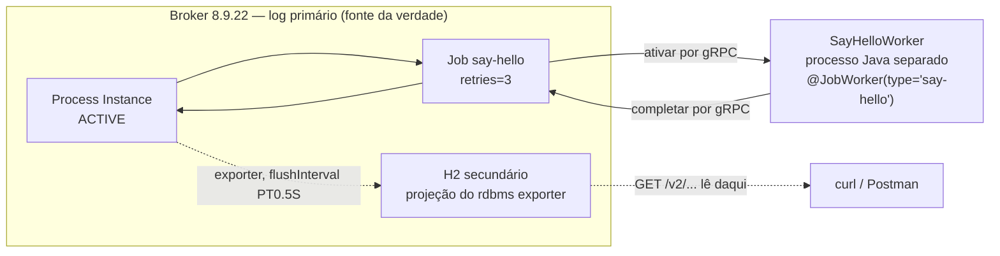

# LESSON-002 — Deploy, Instância e Primeiro Job Worker

Status: review

Escopo de versão: **Camunda 8.9.x** ([ADR-0002](../../adr/0002-camunda-8-version-pin.md)), verificado em cluster `8.9.22`.

Evidência: [evidence.md](evidence.md)
Conhecimento base: [Lesson 000](../000-camunda-bpmn-concepts/lesson.md) · [Lesson 001](../001-camunda7-8-mental-model/lesson.md)

> A versão anterior desta lição citava um `SimpleWorker` com `ZeebeClient` e `usePlaintext()`, logs que o repositório nunca produziu, e um `-F "deployment-name=..."` que o contrato v2 rejeita. A correção está registrada lado a lado em [evidence.md](evidence.md#correção-do-registro-anterior). O código real é [`SayHelloWorker`](../../../apps/first-worker/src/main/java/com/camunda8/lab/firstworker/SayHelloWorker.java).

## Objetivo

Conectar vocabulário (000) com runtime (001): implantar um BPMN, criar uma Process Instance e ter um Job Worker consumindo o Job de um Service Task. O foco é **evidência observada**, incluindo o caminho que falhou.

## 1. BPMN mínimo

`lesson-002-first-worker`: Start → Service Task `say-hello` (`type=say-hello`, `retries=3`) → End.

Arquivo: [processes/002-first-worker/first-worker.bpmn](../../../processes/002-first-worker/first-worker.bpmn)

**Fato (8.9):** `zeebe:taskDefinition type="say-hello"` define o job type que o Worker ativa. O nome do tipo é o contrato entre o BPMN e o código — e nada mais valida essa ligação em tempo de deploy. Um typo aqui só aparece quando o Job é criado e ninguém consome.

## 2. Deploy

**Observado:** `POST /v2/deployments` em `multipart/form-data`, devolvendo `deploymentKey`, `processDefinitionKey` e `processDefinitionVersion`. O contrato v2 aceita `resources` e `tenantId`; `deployment-name` é da API v1 por componente e é rejeitado.

**Observado, e contraintuitivo:** reenviar o mesmo recurso é **idempotente**. Mesmo arquivo, mesma `processDefinitionKey` e mesma versão. Conteúdo diferente cria versão nova; voltar a um conteúdo anterior **também** cria versão nova, com key nova. Key nunca é reutilizada. Isso está medido em [evidence.md §2](evidence.md#2-experimentos-de-versionamento-abc) e é **Observado**, não Fato — não achei a regra documentada.

## 3. Instância e o efeito de `awaitCompletion`

**Observado:** `POST /v2/process-instances` com `processDefinitionKey` e `{"name":"Mundo"}` cria a instância em `ACTIVE`.

`awaitCompletion: true` tem **dois regimes**, e nenhum deles é óbvio:

| | sem worker | com worker |
| --- | --- | --- |
| status | `504 DEADLINE_EXCEEDED` | `200` |
| `processInstanceKey` no corpo | **ausente** | presente |
| instância | `ACTIVE`, `endDate` nulo, **não** cancelada | `COMPLETED` |

**Observado:** o `504` vem do Gateway, não do motor, e a instância continua viva e parada no service task. E mesmo com `200`, a REST v2 **não** devolve `state`, `hasEnded` nem `endDate` — o corpo é o da criação. O `200` é a prova de que terminou; o estado confirmável está no `GET`.

O detalhe que só aparece ao ler: a instância é projetada como `ACTIVE` **antes** do worker completar o Job. Pollar por "existe" devolve estado obsoleto; é preciso pollar por `state`.

## 4. Job Worker

[`SayHelloWorker`](../../../apps/first-worker/src/main/java/com/camunda8/lab/firstworker/SayHelloWorker.java) é um método anotado:

```java
@JobWorker(type = "say-hello")
public void handleSayHello(JobClient client, ActivatedJob job) { ... }
```

O completion é **automático**: o starter completa o Job quando o método retorna sem lançar exceção. Não existe `newCompleteCommand` na lição, e essa é a parte que muda o modelo mental.

**Observado (logs integrais):**

```text
=== LESSON-002: Job recebido ===
JobKey: 2251799813760738
ProcessInstanceKey: 2251799813760732
Type: say-hello
Variável 'name': Mundo
Mensagem: Hello, Mundo!
=== Job completado ===
```

### Compatibilidade de dependências

O worker não sobe com uma combinação que parece razoável.

**Fato (8.9)** — [8.9 release announcements](https://docs.camunda.io/docs/reference/announcements-release-notes/890/890-announcements/): *"Camunda Spring Boot Starter default now requires Spring Boot 4.0.x... If you're not yet ready to upgrade, switch to `camunda-spring-boot-3-starter`, which is bundled with Spring Boot 3.5.x."*

| Spring Boot | Starter | Resultado |
| --- | --- | --- |
| 3.3.9 | `camunda-spring-boot-starter` 8.9 | `ClassNotFoundException: AdditionalPathsMapper` |
| 4.0.8 | `camunda-spring-boot-starter` 8.9.22 | contexto sobe, mas `NoSuchMethodError` no httpclient5 |
| 4.0.8 | idem, com `httpclient5`/`httpcore5` pinados | **funciona** |

O segundo erro é o mais instrutivo: o `dependencyManagement` do Spring Boot rebaixa `httpclient5` de 5.6.4 para 5.5.2, e `disableContentCompression()` só existe a partir de 5.6. Compilação passa limpa; a falha é de runtime. Detalhes em [evidence.md](evidence.md#d2--nosuchmethoderror-no-httpclient5).

## 5. O eixo C7 → C8: a fronteira transacional perdida

O que muda não é o formato do banco. É a fronteira.

No **Camunda 7**, o job executor rodava dentro do engine: executar a tarefa e gravar o estado da instância aconteciam na **mesma transação ACID**. Ou os dois, ou nada. O worker era uma extensão do motor, não um sistema distribuído.

No **Camunda 8**, o worker é um processo externo falando gRPC com o Gateway. Ativar o Job e completá-lo são **dois comandos separados**, anexados ao log em instantes separados. Não existe transação compartilhada entre o worker e o motor.

A consequência que se sente na prática é o delivery **at-least-once**: o Job pode ser ativado de novo se o worker travar entre a ativação e o completion, e `retries="3"` existe para conter isso. "O banco virou log" é o **efeito**; a causa é a perda do ACID compartilhado.

**Observado:** com o worker parado, a instância fica `ACTIVE` com `ServiceTask` parada e `EndEvent` **inexistente** — não `COMPLETED` com erro. A fronteira de execução é onde o processo para de ser um grafo síncrono e vira um grafo com espera externa.



A seta tracejada é a janela que a coleção Postman exercita: o log primário já tem o fato, mas a projeção relacional ainda não.

## 6. Verificação

- `mvn test` — 12 testes (`BpmnContractTest` 7, `SayHelloWorkerTest` 5), `Failures: 0`.
- O contrato BPMN↔worker foi provado por mutação: trocar `say-hello` por `say-helo` reprova `BpmnContractTest`. Teste que nunca falhou não tem valor demonstrado.
- Coleção Postman — 22 requests, dois modos (58 asserções sem worker, 56 com worker), `0` falhas.
- O runner teve um bug que produzia **verde falso**; está em [evidence.md §D4](evidence.md#d4--o-runner-dava-verde-sem-rodar-os-testes) porque é o tipo de falha que passa mais vezes do que quebra.

## O que esta lesson deliberadamente não ensina

- **Roteamento por partição e resiliência a falha de broker.** O cluster tem **uma** partição. Nada aqui demonstra comportamento que dependa da contagem de partições.
- **Retries e idempotência em falha.** `retries="3"` está declarado no BPMN, mas **não** foi exercitado com um worker que lança exceção. O que está provado é o caminho feliz e a parada sem worker.
- **Autenticação.** O cluster roda sem, e a lição não cobre identidade.
- **Escala e concorrência do worker.** `maxJobsActive`, `timeout`, backpressure e concorrência entre réplicas ficam para outra lesson.
- **Mensagens, subprocessos e correlação.** O processo é linear e sem eventos.

## Conclusão

Cadeia verificada: **Service Task → Job criado no log → ativação por gRPC → worker executa → completion automático → instância `COMPLETED`**. A mesma cadeia sem worker termina em `504` e instância parada em `ACTIVE`, o que é a informação mais útil da lesson: o service task é uma fronteira de execução, e atravessá-la custa um segundo comando.

## Diagram Review

- [x] Sintaxe Mermaid validada por `docs/validate-mermaid.sh`
- [x] Todo componente do diagrama existe de verdade: `Broker`, `H2`, `SayHelloWorker`, e o cliente `curl`/Postman. Nenhum componente fictício.
- [x] A seta tracejada corresponde ao `flushInterval: PT0.5S` observado na config do container, não a um palpite.
- [x] O diagrama é um **fluxo de runtime**, não um C4. Ele não promete visão de sistema, container ou componente, e a lição não faz afirmação arquitetural de nível acima dele. Decisão registrada aqui para não ser lido como C4 L2.