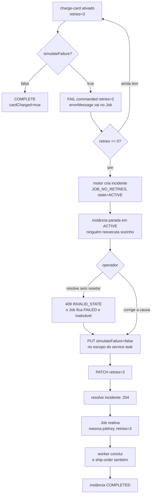

# LESSON-003 — Retries, incidentes e recuperação

Status: review

> Idioma: **PT-BR**. Termos técnicos e nomes de API permanecem em english, porque é assim que
> aparecem na documentação, nos logs e no código. Ver [AGENTS.md](../../../../AGENTS.md).
>
> **Fato** = documentação oficial com versão e URL. **Observado** = saída real de execução.
> **Interpretação** = raciocínio do autor, que pode estar errado.

## Como ler esta lesson

Esta lesson ensina que `retries` é um contador no log, que zerar esse contador **materializa**
uma parada num artefato consultável — o incidente — e que recuperar esse artefato é um trabalho
humano, feito por comandos que **o worker não tem**.

Ela **não** ensina idempotência do efeito colateral, backoff exponencial, nem como monitorar
incidente em produção. Isso está nomeado em [O que esta lesson deliberadamente NÃO ensina](#o-que-esta-lesson-deliberadamente-não-ensina).

## Objetivo

Ao final, o leitor deve conseguir responder: *o que o motor escreve quando um Job esgota os
retries, quem pode desfazer isso, e por que a resposta não é o worker.*

## Contexto

A Lesson 002 ensinou o caminho feliz: o motor cria um Job, um worker o executa, a instância
chega ao fim. Esse caminho é o exceção, não o caso comum. Em produção o cartão é recusado, o
serviço externo está fora, o dado está incompleto.

O behavior ingênuo seria responder a isso com um `while` no worker: tentar de novo até dar
certo. Isso transforma uma falha de integração num loop infinito dentro de um processo que
ninguém consegue enxergar. O que se quer é o oposto — **parar de forma visível**.

## Conceito

### O problema

Quando um Job falha, a pergunta não é "quantas vezes ele tenta". É **o que existe no sistema
depois que ele para**. Um contador que chega a zero e some deixa o operador sem rastro. Um
incidente que chega a zero e fica parado é um objeto que alguém pode listar, avaliar e
resolver.

### A categoria

Camunda 8 separa **falha** de **parada**. Falhar é o worker_reportar que não conseguiu; parar
é o motor decidir que já houve tentativas suficientes. A primeira é escrita pelo worker, a
segunda é escrita pelo motor. Nenhuma das duas é um estado do processo — são estados do **Job**.

### A notação

O `retries="3"` no BPMN não é um parâmetro de política do Camunda 7. É um número que o motor
copia para o Job quando o cria, e a partir daí é o Job que o carrega:

```xml
<zeebe:taskDefinition type="charge-card" retries="3"/>
```

**Observado** — o Job já nasce com o valor, antes de qualquer worker existir:

```bash
$ curl -X POST http://localhost:8080/v2/jobs/search -H 'Content-Type: application/json' \
    -d '{"filter":{"type":"probe-003"}}' | jq -c '.items[]|{state,retries}'
{"state":"CREATED","retries":3}
```

### O vocabulário

| Termo | O que é, aqui |
|---|---|
| `retries` | contador que o motor carrega no Job; decrementa a cada falha |
| `errorMessage` | texto que o worker escreve no comando de falha; o incidente herda |
| `incident` | registro que o motor cria quando `retries` chega a 0, com estado próprio |
| `errorType` | `JOB_NO_RETRIES` é o que diz *por que* este Job parou |
| resolução | ato de declarar o incidente tratado; **não** é um "desfazer" |

### A forma

O worker tem um verbo só: **falhar** ou **concluir**. Em código:

```java
@JobWorker(type = "charge-card", autoComplete = false)
public void handleChargeCard(ActivatedJob job, @Variable(name = "simulateFailure") boolean simulateFailure) {
    if (decidir(simulateFailure, job.getRetries()) == Decisao.FALHAR) {
        jobClient.newFailCommand(job)
                .retries(job.getRetries() - 1)
                .errorMessage(FALHA)
                .send().join();
        return;
    }
    jobClient.newCompleteCommand(job).variables(Map.of("cardCharged", true)).send().join();
}
```

`autoComplete = false` não é estilo. O starter completa o Job sozinho quando o método
retorna; deixar ligado Mandaria `COMPLETE` junto com o `FAIL`, e quem estuda esta lesson
precisa que o comando seja o objeto de estudo.

## Modelo mental

**"O que quebraria sem isto?"**

- **Sem o contador**, o motor não teria como distinguir "uma falha" de "não há mais o que
  tentar". A parada seria um palpite do worker.
- **Sem o incidente**, a parada existiria só dentro do Job falhado. Quem olhasse a lista de
  Jobs veria `FAILED` e não saberia o que fazer — nem se já estava sendo tratado.
- **Sem `errorType`**, `JOB_NO_RETRIES` seria indistinguível de qualquer outra causa. O
  operador teria que abrir cada Job para ler a mensagem.
- **Sem a separação entre falhar e recuperar**, o incidente seria uma conveniência do worker e
  não uma decisão humana.

O ponto que resume a lesson inteira:

> **Quem consegue falhar não consegue recuperar.** O Java Client 8.9.22 tem
> `newFailCommand(...)` e não expõe reset de retries nem resolução de incidente.

**Observado** — a classe de comando existe e nenhuma interface pública a devolve:

```bash
$ rg 'UpdateRetriesJobCommandStep1 ' -g '!*Test*' .   # nenhum retorno
```

## Camunda 7 → 8

Em Camunda 7, o Job, o contador de retry e o registro de incidente eram linhas da **mesma
transação** que recebia o relatório de falha. Uma transação ACID: ou o contador decrementava e
o incidente existia, ou nada acontecia. O operador nunca via meio estado.

Em Camunda 8, "Job falhou com `retries=0`" e "incidente criado" são **dois comandos no log**.
A resolução é um terceiro. Nenhum é atômico em relação ao outro, e o cluster inteiro pode
cair entre eles.

> **O que quebra é a fronteira transacional ACID compartilhada entre aplicação e engine.**
> "O banco virou log" é consequência, não causa.

**Observado** — a consequência prática, que é um `409` em vez de um lock:

```json
{"title":"INVALID_STATE","status":409,
 "detail":"Expected to resolve incident with key '2251799813774007', but job with key
  '2251799813774005' has no retries left. Please update the job retries and retry
  resolving the incident"}
```

Recuperar são **dois comandos com ordem**, não um. E quem impõe a ordem é o motor, não o SDK.

## Onde esta lesson termina — e o que falta para responder

Termina quando a instância volta a andar depois de um incidente, com o operador como ator.
Não termina no desenho do que faria um agente de auto-recuperação, nem em como monitorar
quantos incidentes estão abertos. Isso está adiado.

## O que esta lesson deliberadamente NÃO ensina

- **Idempotência do efeito colateral.** O worker é determinístico e não cobra ninguém duas
  vezes. A Lesson 003 não resolve isso e diz isso.
- **Backoff exponencial.** Só foi observado o `retryBackOff` de janela única, passado no
  comando de falha.
- **Monitoramento e SLA de incidente.** Operate Cloud faz isso; aqui é cluster local.
- **Job worker versioning, multi-tenancy, autenticação, múltiplas partições, escala.**

## Exemplo mínimo

O menor exemplo é o próprio `apps/retry-worker`: dois service tasks, um falível com
`retries="3"`, e a sequência de três comandos que resolve o incidente.

## Implementação

`processes/003-retries-incidentes-recuperacao/order-fulfillment.bpmn` — `charge-card` com
`retries="3"`, e `ship-order` depois dele.

`ship-order` existe por um motivo pedagógico, não por necessidade: **sem ele, a instância
terminaria no service task falível e não haveria como provar que a recuperação leva a
instância até o fim.** Um processo que só trava não demonstra que o recovery funciona.

`apps/retry-worker` é um módulo **independente**, com o seu próprio pom, o seu BPMN e os seus
testes. Não toca na Lesson 002: cada app implementa o seu conceito sem arrastar o contrato do
anterior.

A decisão de falhar está isolada em `decidir(simulateFailure, retries)`, função pura. Testar o
método inteiro exigiria mockar uma cadeia de builders e o teste passaria a afirmar que a API
foi chamada, não que a decisão foi a certa.

O `simulateFailure` é uma **variável de processo**, não uma flag do worker. Isso é o que
permite que a correção da causa seja um ato do operador, e não um deploy.

## Execução

```bash
# 1. worker no ar
./infra/local/mise.sh exec -- mvn -q -f apps/retry-worker/pom.xml spring-boot:run

# 2. deploy e instância com a falha ligada
curl -X POST http://localhost:8080/v2/deployments \
  -F "resources=@processes/003-retries-incidentes-recuperacao/order-fulfillment.bpmn"
curl -X POST http://localhost:8080/v2/process-instances \
  -H 'Content-Type: application/json' \
  -d '{"processDefinitionKey":"<PDK>","variables":{"simulateFailure":true}}'

# 3. esperar o incidente aparecer
curl -X POST http://localhost:8080/v2/process-instances/<PIK>/incidents/search \
  -H 'Content-Type: application/json' -d '{}'

# 4. o runbook, nesta ordem
curl -X PUT http://localhost:8080/v2/element-instances/<EIK>/variables \
  -H 'Content-Type: application/json' \
  -d '{"variables":{"simulateFailure":false},"local":true}'
curl -X PATCH http://localhost:8080/v2/jobs/<JK> \
  -H 'Content-Type: application/json' -d '{"changeset":{"retries":3}}'
curl -X POST http://localhost:8080/v2/incidents/<IK>/resolution \
  -H 'Content-Type: application/json' -d '{}'
```

Saída real em [evidence.md](evidence.md).

## Falha / investigação / correção

O caminho de erro desta lesson produziu duas correções que ficam registradas em vez de
apagadas.

**O que parecia verdade:** que `TIMED_OUT` e `FAILED` fossem o mesmo evento visto de dois
lugares, e que um Job `TIMED_OUT` tivesse necessarily perdido seu retry.

**O que a medição mostrou:** `errorMessage` **persiste** no registro do Job depois do backoff
(`{"state":"TIMED_OUT","retries":2,"errorMessage":"backoff probe"}`), mas não vem no payload
de ativação. São registros diferentes.

**N/A** — se `TIMED_OUT` consome retry. Um Job `TIMED_OUT` com `retries=3` sugere que não,
mas não foi medido de forma controlada. A lesson afirma que os estados são distintos e **para
por aí**.

**Um probe invalidado.** A primeira medição de backoff "provou" que backoff não existe: a
ativação devolveu 1 Job. O Job devolvido era de uma execução anterior do mesmo tipo. O valor
verdadeiro, com tipo único por execução, é `0` dentro da janela e `1` depois. É o mesmo
defeito de escopo que a Lesson 002 cometeu e que foi corrigido em `5431834` — medir varrendo
estado acumulado do ambiente em vez do objeto do request.

## Implicações de arquitetura

- **O runbook é parte do desenho.** Se a correção da causa exigir deploy, o incidente é um
  uma fila de trabalho do operador e o tempo de recuperação é tempo de deploy. A lição escolheu variável
  de processo justamente para tornar a recuperação um ato, não um ciclo de release.
- **Reset de retries é privilégio de operador.** Nenhum componente da aplicação pode devolvê-lo.
  Isso é uma fronteira de permissão real, e quem projeta automação precisa saber que ela
  existe.
- **`jobs/search` não serve para decidir prontidão.** O índice secundário atrasa: foi observado
  devolvendo `FAILED retries=0` logo após um `PATCH` que já tinha gravado `retries=3`.
  `activation` é o motor; `search` é uma projeção.
- **Recuperar não é reexecutar do zero.** O Job é o mesmo `jobKey`. Se o efeito colateral for
  externo, reexecutar pode cobrar duas vezes — e essa é a lacuna nomeada no escopo.

## Perguntas de entrevista

**P: o que acontece quando um Job esgota os retries?**
R: o motor escreve um incidente com `errorType=JOB_NO_RETRIES`, e a instância fica parada
esperando. Não há estado "desistido": há um incidente, com estado próprio.
*T:* mostrar o Job em `FAILED retries=0`, o incidente `ACTIVE` e a instância `ACTIVE`.
Ler o `errorMessage` no incidente e mostrar que veio do worker.

**P: por que o incidente é separado do Job?**
R: porque ele tem ciclo de vida, causa e dono diferentes. O Job é uma unidade de trabalho; o
incidente é uma unidade de decisão.
*T:* resolver o mesmo incidente duas vezes — a segunda responde `404`, porque o primeiro já
o marcou `RESOLVED`.

**P: por que a ordem reset → resolve é obrigatória?**
R: porque são dois comandos separados no log, e o motor recusa resolver enquanto o Job não tem
retry. Não há transação que garanta os dois.
*T:* resolver primeiro e mostrar o `409 INVALID_STATE` cujo `detail` diz exatamente
`Please update the job retries and retry resolving the incident`.

**P: o worker pode se recuperar sozinho?**
R: não, e essa é a resposta que a maioria erra. O Java Client 8.9.22 expõe `newFailCommand` e
não expõe reset de retries nem resolução de incidente.
*T:* `rg 'UpdateRetriesJobCommandStep1 '` e mostrar que a classe existe sem nenhum chamador
público. Não é limitação do REST; é do SDK.

**P: o que muda de Camunda 7 para 8 aqui?**
R: em C7, decremento de retry e criação de incidente eram a mesma transação. Em C8 são
comandos distintos no log, e a recuperação precisa de coordinating fora do worker.
*T:* apontar o `409` como consequência direta da fronteira transacional perdida.

## Evidência

- [evidence.md](evidence.md) — o ciclo real, o `409`, o backoff, os testes e a prova por mutação
- [SPEC-003](../../../specs/003-retries-incidentes-recuperacao/spec.md)
- [ADR-0002](../../../adr/0002-camunda-8-version-pin.md)
- [Lesson 002](../002-deploy-instance-worker/lesson.md) — o caminho feliz e a correção da fronteira REST/gRPC
- [Incidentes (8.9)](https://docs.camunda.io/docs/components/concepts/incidents)
- [Service tasks e retries (8.9)](https://docs.camunda.io/docs/components/modeler/bpmn/service-tasks/)

## Diagrama do ciclo observado

Diagrama de **sequência de comandos**, não C4: não é arquitetura de container, e não deve ser
lido como tal.



## Diagram Review

- [x] Sintaxe Mermaid validada por `docs/validate-mermaid.sh`
- [x] Todos os diagramas renderizam
- [x] Nível arquitetural correto — diagrama de sequência de comandos, explicitamente rotulado como não-C4
- [x] Componente lógico e container físico não estão misturados — o diagrama não mostra container
- [x] Todos os nós têm responsabilidade definida
- [x] Relações válidas
- [x] Direção das relações correta — o ciclo de falha desce, a recuperação sobe
- [x] Sem nós órfãos
- [x] Sem componentes não explicados
- [x] Sem componente fictício — os nós são comandos REST e respostas reais observadas
- [x] Sem contradição com o texto da lesson
- [x] Sem contradição com outros diagramas
- [x] Alegações sensíveis a versão verificadas contra a documentação da versão-alvo
- [x] Rótulos e documentação em PT-BR

## Critérios de conclusão

- [x] Conceito entendido
- [x] Modelo mental explicado
- [x] Distinção relevante C7 → 8 documentada
- [x] Escopo definido por SPEC
- [x] Experimento implementado quando aplicável
- [x] Testes executados — 16 verdes, com prova por mutação
- [x] Caminho de falha investigado quando relevante
- [x] Achados documentados a partir de execução real
- [x] Implicações de arquitetura documentadas
- [x] Revisão de entrevista concluída
- [ ] Revisão independente concluída

## O que ainda não é verdade sobre esta lesson

**Gate que falta:** revisão independente. Ninguém além do autor leu esta lesson.

**Perguntas abertas honestas para o revisor:**

1. A inversão — resetar e resolver **sem** corrigir a causa — não foi executada. A lesson
   afirma, a partir do comportamento do worker, que isso reesgotaria os retries. É inferência
   de boa qualidade, mas é inferência. **Precisa de um probe.**
2. O `local:true` no `PUT` de variáveis funciona e o worker leu o valor local, mas não foi
   comparado com um segundo service task lendo a mesma variável. A leitura de escopo não tem
   prova experimental.
3. O diagrama foi reescrito depois do primeiro draft, em que o nó de decisão de `retries`
   vinha antes da decisão e deixava ambíguo qual nó saía do Job ativado. `validate-mermaid.sh` passou
   nas duas versões: ele valida renderização, não legibilidade do fluxo.
4. `TIMED_OUT` e seus efeitos no contador estão declarados `N/A` na evidence, e a lesson
   depende desse `N/A` para não afirmar o que não mediu. Se o revisor achar que o silêncio é
   piores que a afirmação, é preciso medir.